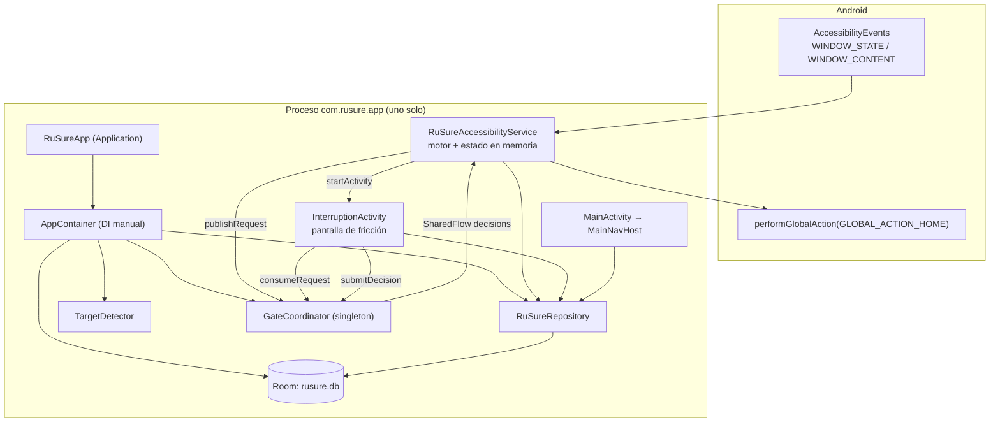
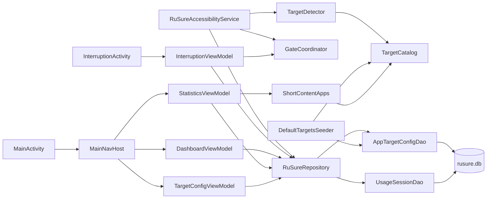
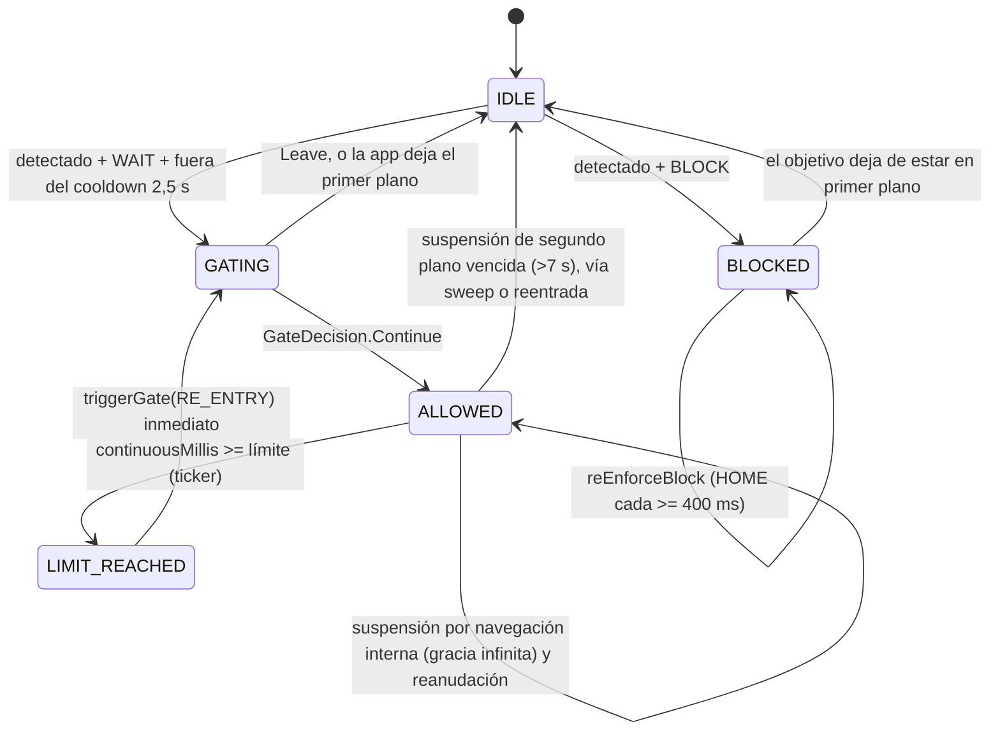
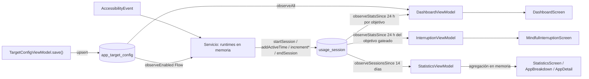
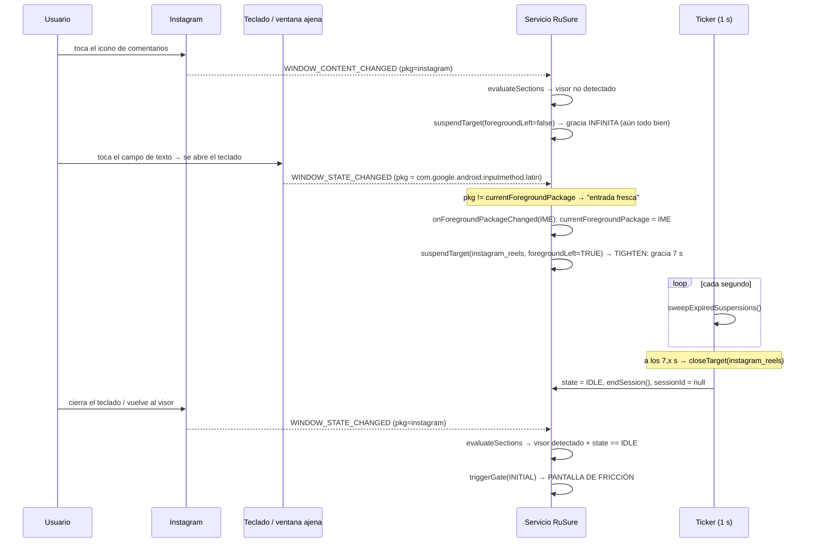

# RuSure — Deep Init Report

> **Qué es este documento**: la reconstrucción de **cómo funciona hoy** la aplicación, a partir de la
> lectura completa del código fuente. **No es una especificación**: nada de lo descrito aquí debe
> interpretarse como "comportamiento deseado". Las decisiones de producto confirmadas viven en
> `docs/DECISIONS.md`; las que faltan, en la sección [33. Preguntas abiertas](#33-preguntas-abiertas).
>
> Fecha del análisis: **2026-09-13** · Rama: `main` · Último commit: `72e3238 cositas`
> (con cambios sin commitear en la capa de estadísticas y `StatisticsViewModel.kt` sin trackear).

## Convención de confianza

| Etiqueta | Significado |
|---|---|
| `VERIFICADO EN CÓDIGO` | Demostrable leyendo el código citado. |
| `VERIFICADO EXPERIMENTALMENTE` | Reproducido ejecutando algo en esta sesión. |
| `OBSERVADO` | Hay evidencia del comportamiento (reportado por el usuario), sin causa validada en ejecución. |
| `INFERIDO` | Conclusión razonable a partir del código + comportamiento conocido de Android, no ejecutada. |
| `DESCONOCIDO` | No hay información suficiente. |

**Alcance de la ejecución en esta sesión**: `.\gradlew.bat :app:testDebugUnitTest --offline` termina
con éxito (exit 0; 5 tests, 0 fallos — `app/build/test-results/testDebugUnitTest/TEST-com.rusure.app.FormattersTest.xml`),
lo que confirma que **todo el árbol de trabajo actual compila**, incluido el `StatisticsViewModel`
sin trackear. `adb devices` no lista ningún dispositivo/emulador, por lo que **no ha sido posible
reproducir en ejecución ningún flujo de accesibilidad**. Todo lo relativo a Instagram/TikTok queda
por tanto `VERIFICADO EN CÓDIGO` (el mecanismo) + `INFERIDO` (que el disparador concreto ocurre en el
dispositivo) + `OBSERVADO` (el síntoma reportado por el usuario).

---

# 1. Resumen ejecutivo

RuSure es una app Android nativa de bienestar digital que **no bloquea**: interpone *fricción*
(cuenta regresiva) antes y durante el uso de apps/secciones de alto consumo (TikTok, Instagram Reels,
YouTube Shorts). El motor es un `AccessibilityService` que observa eventos de ventana del sistema,
mantiene una **máquina de estados en memoria por objetivo** y lanza una Activity translúcida sobre la
app objetivo.

Descubrimientos principales de esta auditoría:

1. **El sistema no sabe si el usuario "salió de la app". Lo infiere** de una sola señal:
   `event.packageName != currentForegroundPackage` en *cualquier* evento de accesibilidad
   (`RuSureAccessibilityService.onAccessibilityEvent` → `onForegroundPackageChanged`).
   `VERIFICADO EN CÓDIGO`
2. Esa señal es **falsa para ventanas que no son la app**: teclado (IME), persiana de notificaciones,
   diálogos del sistema, selectores de permisos… Todos emiten eventos con **su propio packageName** y
   son interpretados como "la app objetivo dejó el primer plano". `INFERIDO` (alta confianza)
3. Cuando eso ocurre, el objetivo pasa a suspensión con **gracia de 7 s**; un barredor que corre cada
   segundo (`sweepExpiredSuspensions`) **cierra la sesión y devuelve el estado a `IDLE`** pasada esa
   ventana. Después, el siguiente evento de la app objetivo se interpreta como **una apertura nueva**
   → se dispara la fricción. `VERIFICADO EN CÓDIGO`
4. **Esta es la causa común de los dos síntomas reportados** (comentarios de Instagram y buscador de
   TikTok): ambas interacciones abren el teclado y suelen durar más de 7 s.
5. Existen además 8 bugs y 12 comportamientos sospechosos independientes (§28–§30): fuga de sesiones
   al desactivar un objetivo, catálogo que nunca se re-siembra, pantalla de fricción que puede
   desaparecer dejando la app "libre", ventanas temporales congeladas en estadísticas, etc.

**No se ha modificado ningún comportamiento.** Los únicos ficheros escritos son documentación.

---

# 2. Propósito de la aplicación

`VERIFICADO EN CÓDIGO` (`CLAUDE.md`, `res/values/strings.xml`, `domain/catalog/TargetCatalog.kt`)

Insertar **fricción intencional** antes y durante el consumo de contenido corto, en lugar de
bloquear. Tres objetivos curados:

| catalogKey | Paquete | Tipo | Cómo se detecta |
|---|---|---|---|
| `tiktok_global` | `com.zhiliaoapp.musically` | `APP_GLOBAL` | Por nombre de paquete |
| `instagram_reels` | `com.instagram.android` | `SECTION` | 3 resource-ids del visor de Reels |
| `youtube_shorts` | `com.google.android.youtube` | `SECTION` | 3 resource-ids + descripciones "Shorts"/"Short" |

Por objetivo el usuario configura: activo sí/no, acción al entrar (`WAIT` = cuenta regresiva /
`BLOCK` = bloqueo total), espera inicial (s), recordatorio de uso continuo (min) y espera tras
recordatorio (s). Toda la UI está en español, con los textos hardcodeados en los Composables.

---

# 3. Arquitectura general

Módulo único `:app`, paquete `com.rusure.app`, capas con **DI manual** (no Hilt; ver §30).



| Capa | Paquete | Contenido |
|---|---|---|
| Datos | `data/` | Room (`RuSureDatabase`, 2 entidades, 2 DAOs, `Converters`), `RuSureRepository` (única fachada), `DefaultTargetsSeeder` |
| Dominio | `domain/` | `catalog/TargetCatalog`, `detection/TargetDetector`, `gate/*`, `model/*` |
| Servicio | `service/` | `RuSureAccessibilityService` — **el motor** (676 líneas, toda la lógica de decisión) |
| UI | `ui/` | `dashboard/`, `statistics/`, `config/`, `interruption/`, `navigation/`, `settings/`, `theme/`, `util/` |
| DI | `di/AppContainer.kt` | Singletons de proceso |

**Regla arquitectónica real**: la Activity de fricción y el servicio **nunca se referencian entre
sí**; todo el contrato pasa por `GateCoordinator` (un `AtomicReference` + un `SharedFlow`).
`VERIFICADO EN CÓDIGO`

**Desviación respecto a una arquitectura teórica limpia**: no hay capa de casos de uso. El servicio
concentra detección de intención, máquina de estados, temporización y escritura de estadísticas. Las
decisiones de producto viven ahí, no en `domain/`.

---

# 4. Estructura del proyecto

```
RUSURE/
├── build.gradle.kts, settings.gradle.kts, gradle.properties
├── gradle/libs.versions.toml          # AGP 9.2.1, Kotlin 2.2.10, Room 2.7.2, Compose BOM 2026.02.01
├── CLAUDE.md                          # contexto operativo para Claude Code
├── docs/                              # creado por este Deep Init
└── app/src/
    ├── main/AndroidManifest.xml
    ├── main/res/xml/accessibility_service_config.xml
    ├── main/java/com/rusure/app/
    │   ├── RuSureApp.kt               # Application: crea AppContainer + siembra catálogo
    │   ├── MainActivity.kt            # única Activity de UI normal
    │   ├── di/AppContainer.kt
    │   ├── data/local/{RuSureDatabase,Converters}.kt
    │   ├── data/local/entity/{AppTargetConfig,UsageSession}.kt
    │   ├── data/local/dao/{AppTargetConfigDao,UsageSessionDao}.kt
    │   ├── data/repository/RuSureRepository.kt
    │   ├── data/seed/DefaultTargetsSeeder.kt
    │   ├── domain/catalog/TargetCatalog.kt
    │   ├── domain/detection/TargetDetector.kt
    │   ├── domain/gate/{GateCoordinator,GateModels,GateState}.kt
    │   ├── domain/model/{GateAction,TargetType,UsageStats}.kt
    │   ├── service/RuSureAccessibilityService.kt      # ★ el motor
    │   ├── ui/navigation/{MainNavHost,AppBottomBar}.kt
    │   ├── ui/dashboard/{DashboardScreen,DashboardViewModel}.kt
    │   ├── ui/statistics/{StatisticsScreen,StatisticsViewModel,StatisticsModels,
    │   │                  StatisticsComponents,StatisticsIcons,AppBreakdownScreen,AppDetailScreen}.kt
    │   ├── ui/config/{TargetConfigScreen,TargetConfigViewModel}.kt
    │   ├── ui/interruption/{InterruptionActivity,InterruptionViewModel,MindfulInterruptionScreen}.kt
    │   ├── ui/settings/AccessibilityStatus.kt
    │   └── ui/util/Formatters.kt
    ├── test/java/com/rusure/app/FormattersTest.kt      # 5 tests (los únicos)
    └── androidTest/java/com/rusure/app/ExampleInstrumentedTest.kt  # plantilla vacía
```

Ningún fichero es irrelevante: los "pequeños" (`AccessibilityStatus.kt`, `Converters.kt`,
`GateState.kt`) son puntos de contrato. Los `*Icon` dibujados con `Canvas` existen porque el proyecto
solo depende de `material-icons-core`.

**Estado del árbol de trabajo**: hay cambios sin commitear en la capa de estadísticas
(`RuSureDatabase`, `UsageSessionDao`, `UsageSession`, `RuSureRepository`, `AppContainer`,
`RuSureAccessibilityService`, `TargetConfigScreen`, `MainNavHost`, `AppDetailScreen`,
`StatisticsModels`) y `StatisticsViewModel.kt` **sin trackear**. Este informe describe el árbol de
trabajo actual, no el último commit. `VERIFICADO EN CÓDIGO`

---

# 5. Componentes principales

# 6. Responsabilidad de cada componente

(Secciones fusionadas: una ficha por componente, en el formato pedido.)

### `RuSureApp`
```
Ubicación            app/src/main/java/com/rusure/app/RuSureApp.kt
Responsabilidad      Crear el AppContainer del proceso y sembrar el catálogo la primera vez
Quién lo llama       El sistema (android:name=".RuSureApp")
Recibe               —
Produce              container: AppContainer (público, lateinit)
Depende de           AppContainer, DefaultTargetsSeeder
Estado que modifica  Tabla app_target_config (solo si está vacía)
Dependen de él       MainActivity, InterruptionActivity, RuSureAccessibilityService
```

### `AppContainer`
```
Ubicación            di/AppContainer.kt
Responsabilidad      Singletons de proceso: database, DAOs, repository, detector, gateCoordinator
Quién lo llama       RuSureApp.onCreate()
Recibe               Context
Produce              RuSureDatabase (lazy; migraciones 1→2, 2→3, 3→4 + fallbackToDestructiveMigration)
Estado que modifica  Ninguno (fábrica)
Dependen de él       Todo
```
Nota crítica: `gateCoordinator` **debe** ser único en el proceso. Como no hay `android:process` en el
manifiesto, servicio y Activity de fricción comparten instancia. `VERIFICADO EN CÓDIGO`

### `RuSureAccessibilityService`  ★
```
Ubicación            service/RuSureAccessibilityService.kt
Responsabilidad      Motor completo: recibir eventos, inferir intención, mantener GateState por
                     objetivo, disparar la fricción, cronometrar el uso continuo, escribir sesiones
Quién lo llama       El sistema Android (BIND_ACCESSIBILITY_SERVICE), tras activarlo el usuario
Recibe               AccessibilityEvent (typeWindowStateChanged, typeWindowContentChanged)
Produce              GateRequest (vía GateCoordinator), startActivity(InterruptionActivity),
                     performGlobalAction(GLOBAL_ACTION_HOME), filas/updates en usage_session
Depende de           RuSureRepository, TargetDetector, GateCoordinator, PowerManager, KeyguardManager
Estado que modifica  runtimes: HashMap<catalogKey, TargetRuntime> (EN MEMORIA, no persistido),
                     currentForegroundPackage, activeCatalogKey, enabledTargets, y la BD de sesiones
Dependen de él       InterruptionActivity (indirectamente, vía GateCoordinator)
```

### `GateCoordinator`
```
Ubicación            domain/gate/GateCoordinator.kt
Responsabilidad      Puente desacoplado servicio ↔ Activity de fricción
Quién lo llama       Servicio (publishRequest), InterruptionViewModel (consumeRequest/submitDecision)
Produce              AtomicReference<GateRequest?> "pending" + SharedFlow<GateDecision> (buffer 8)
Estado que modifica  El request pendiente (one-shot: consumeRequest hace getAndSet(null))
```

### `TargetDetector`
```
Ubicación            domain/detection/TargetDetector.kt
Responsabilidad      Traducir (paquete, árbol de nodos) → objetivo activo
Quién lo llama       El servicio: handleAppGlobal (detectAppTarget), evaluateSections (detectSection)
Recibe               packageName / AccessibilityNodeInfo root + objetivos habilitados
Produce              AppTargetConfig? (el objetivo detectado)
Estado que modifica  Ninguno (puro)
```
Estrategia: (1) `findAccessibilityNodeInfosByViewId` por cada `viewIdMatcher`, exigiendo
`isVisibleToUser`; (2) respaldo BFS de hasta **600 nodos** recogiendo textos/descripciones de nodos
`isSelected && isVisibleToUser` y comparando con `contentDescMatchers` (`contains`, case-insensitive).
`VERIFICADO EN CÓDIGO`

### `TargetCatalog`
```
Ubicación            domain/catalog/TargetCatalog.kt
Responsabilidad      Catálogo estático: matchers de detección + valores por defecto
Quién lo llama       TargetDetector, DefaultTargetsSeeder, StatisticsModels (solo las claves)
```
Decisión de diseño explícita: **los matchers viven en código, no en la BD**, para actualizarlos sin
migraciones cuando Instagram/YouTube cambien sus resource-ids.

### `RuSureRepository`
```
Ubicación            data/repository/RuSureRepository.kt
Responsabilidad      Única fachada de persistencia
Produce              Flows de configuración, agregados de 24 h, sesiones crudas; ops de sesión
Dependen de él       Servicio y los 4 ViewModels
```

### ViewModels
| ViewModel | Estado que expone | Escribe |
|---|---|---|
| `DashboardViewModel` | `DashboardUiState` (resumen 24 h + tarjetas) | nada |
| `StatisticsViewModel` | `StatisticsScreenData` (14 días agregados en memoria) | nada |
| `TargetConfigViewModel` | `TargetConfigUiState` con **draft** local | `upsertTarget`, solo en `save()` |
| `InterruptionViewModel` | `InterruptionUiState` (cuenta atrás + stats 24 h) | nada (emite decisiones) |

Todos con `companion object fun factory(container)` + `viewModelFactory { initializer { … } }`.

### Pantallas Compose
| Pantalla | Fichero | Cuándo aparece |
|---|---|---|
| Dashboard "Mi tiempo" | `ui/dashboard/DashboardScreen.kt` | Pestaña Menú (destino inicial) |
| Configuración de objetivo | `ui/config/TargetConfigScreen.kt` | Al pulsar una tarjeta del dashboard |
| Estadísticas | `ui/statistics/StatisticsScreen.kt` | Pestaña Estadísticas |
| Detalle por aplicación | `ui/statistics/AppBreakdownScreen.kt` | Desde Estadísticas |
| Detalle individual | `ui/statistics/AppDetailScreen.kt` | Desde Detalle por aplicación |
| **Pantalla de fricción** | `ui/interruption/MindfulInterruptionScreen.kt` | La lanza el **servicio** sobre otra app |

---

# 7. Dependencias entre componentes



Acoplamientos que conviene conocer:

* `ShortContentApps` (`ui/statistics/StatisticsModels.kt`) **duplica** los `packageName` que ya están
  en `TargetCatalog` (solo reutiliza las claves `KEY_*`). Añadir una app al catálogo no la añade a
  estadísticas. `VERIFICADO EN CÓDIGO`
* `AppBottomBar` importa `HomeIcon`/`BarsIcon` de `ui/statistics/StatisticsIcons.kt`: dependencia
  navegación → estadísticas por reutilización de glifos.
* El servicio depende de la clase concreta `ui.interruption.InterruptionActivity` para el `Intent`.

---

# 8. Flujo de inicialización

`VERIFICADO EN CÓDIGO`

```mermaid
sequenceDiagram
    participant SYS as Android
    participant APP as RuSureApp
    participant DB as Room
    participant SVC as AccessibilityService
    participant UI as MainActivity

    SYS->>APP: onCreate()
    APP->>APP: container = AppContainer(this)   %% todo lazy
    APP->>DB: appScope(IO).launch seedIfEmpty → construye la BD (migraciones 1→2→3→4)
    DB-->>APP: count()==0 ? insertAll(3 objetivos, enabled=false)

    par Rama servicio (solo si el usuario lo activó en Ajustes)
        SYS->>SVC: onServiceConnected()
        SVC->>SVC: collect observeEnabledTargets() → enabledTargets
        SVC->>SVC: collect gateCoordinator.decisions → handleDecision
        SVC->>SVC: startUsageTicker() (bucle 1 s)
    and Rama UI (solo si el usuario abre la app)
        SYS->>UI: onCreate()
        UI->>UI: enableEdgeToEdge(); setContent { RuSureTheme { MainNavHost(container) } }
    end
```

1. **`RuSureApp.onCreate()`** crea el `AppContainer`; todo dentro es `by lazy`, así que la BD se
   construye en el primer acceso, dentro de la corrutina de siembra (hilo IO).
2. **Siembra** (`DefaultTargetsSeeder.seedIfEmpty`): si `count() > 0` no hace nada; los 3 objetivos
   se insertan **deshabilitados**.
3. **Servicio**: solo arranca si el usuario lo habilitó en Ajustes de Accesibilidad. Sin él, la app
   es un visor de estadísticas inerte y el dashboard muestra "Servicio desactivado"
   (`AccessibilityStatus.isServiceEnabled`, re-evaluado en cada `ON_RESUME`).
4. **Estado inicial del motor**: `runtimes` vacío (cada objetivo nace `IDLE` en su primer acceso vía
   `runtimeFor`), `currentForegroundPackage = null`, `activeCatalogKey = null`,
   `enabledTargets = emptyList()` hasta la primera emisión del Flow.

**Qué puede fallar / no estar disponible**

| Condición | Consecuencia actual |
|---|---|
| Servicio de accesibilidad desactivado | No hay detección ni fricción; la UI sigue mostrando histórico. `VERIFICADO EN CÓDIGO` |
| Objetivo deshabilitado (por defecto) | El servicio lo ignora (`observeEnabled` filtra `enabled = 1`). |
| App objetivo no instalada | Los iconos caen a un avatar con la inicial (`runCatching`). |
| Primera emisión del Flow aún no llegada | `enabledTargets` vacío: los primerísimos eventos no gatean. `INFERIDO` |
| Ruta de migración no contemplada | `fallbackToDestructiveMigration(dropAllTables = true)` **borra configuración e historial**. |
| El proceso muere | Se pierde la máquina de estados y el `GateRequest` pendiente; las sesiones abiertas quedan sin `endEpochMillis`. |

---

# 9. Flujo de ejecución

Trayecto nominal con `entryAction = WAIT` (`VERIFICADO EN CÓDIGO`):

```mermaid
sequenceDiagram
    participant U as Usuario
    participant OS as Android
    participant SVC as Servicio
    participant REPO as Repository
    participant GC as GateCoordinator
    participant ACT as InterruptionActivity

    U->>OS: abre TikTok
    OS->>SVC: TYPE_WINDOW_STATE_CHANGED (pkg=com.zhiliaoapp.musically)
    SVC->>SVC: freshForeground = pkg != currentForegroundPackage → true
    SVC->>SVC: onForegroundPackageChanged(pkg): suspende objetivos del pkg anterior
    SVC->>SVC: handleAppGlobal → detectAppTarget → IDLE → triggerGate(INITIAL)
    SVC->>SVC: state = GATING; lastGateTriggerMillis = now (cooldown 2,5 s)
    SVC->>REPO: getOpenSession ?: startSession + incrementInterruptions
    SVC->>GC: publishRequest(GateRequest)
    SVC->>OS: startActivity(InterruptionActivity, NEW_TASK|CLEAR_TASK|NO_ANIMATION)
    OS->>ACT: onCreate
    ACT->>GC: consumeRequest() (one-shot, en el constructor del ViewModel)
    ACT->>REPO: observeStats24h(catalogKey)
    ACT->>ACT: cuenta regresiva de 1 s en viewModelScope
    U->>ACT: "Continuar" (habilitado solo con remainingSeconds <= 0)
    ACT->>GC: submitDecision(Continue)
    ACT->>ACT: finish()
    GC-->>SVC: decisions.collectLatest → handleDecision
    SVC->>SVC: ALLOWED; activeCatalogKey = key; continuousMillis = 0
    loop cada 1 s mientras ALLOWED y la app está en primer plano
        SVC->>SVC: continuousMillis += 1000; unflushedActiveMillis += 1000 (si no suspendido)
        SVC->>REPO: addActiveTime cada 5 ticks
    end
    SVC->>SVC: continuousMillis >= límite → LIMIT_REACHED → triggerGate(RE_ENTRY)
```

Con `entryAction = BLOCK`, `triggerGate` cortocircuita en `blockTarget`: no hay pantalla; se registra
una sesión (apertura) que se cierra al instante con su interrupción, el estado pasa a `BLOCKED` y se
ejecuta `GLOBAL_ACTION_HOME`. Mientras el objetivo siga en primer plano, cada evento vuelve a pulsar
HOME con un limitador de 400 ms (`reEnforceBlock`). `VERIFICADO EN CÓDIGO`

---

# 10. Sistema de eventos

## 10.1 Configuración de la escucha

`res/xml/accessibility_service_config.xml` (`VERIFICADO EN CÓDIGO`):

```
accessibilityEventTypes = typeWindowStateChanged | typeWindowContentChanged
accessibilityFlags      = flagRetrieveInteractiveWindows | flagReportViewIds | flagIncludeNotImportantViews
canRetrieveWindowContent= true
notificationTimeout     = 100 ms
(no hay android:packageNames)  → SE RECIBEN EVENTOS DE TODAS LAS APPS
```

Consecuencia central: **el servicio recibe eventos del teclado, de SystemUI, del launcher y de los
diálogos del sistema**, no solo de las tres apps objetivo. `flagRetrieveInteractiveWindows` está
activo, pero **el código nunca llama a `getWindows()` ni mira `event.className` / `event.windowId`**
(grep sin coincidencias), así que no dispone del tipo de ventana para distinguir "ventana de
aplicación" de "ventana de IME/sistema". `VERIFICADO EN CÓDIGO`

## 10.2 Inventario de eventos

### Evento A — `TYPE_WINDOW_STATE_CHANGED`
```
Evento            Se abre/cambia una ventana (Activity, diálogo, IME, persiana…)
Quién lo detecta  RuSureAccessibilityService.onAccessibilityEvent (hilo principal)
Info que recibe   event.packageName — NADA MÁS (ni tipo de ventana, ni clase)
Función           onAccessibilityEvent, rama TYPE_WINDOW_STATE_CHANGED (líneas 134-148)
Condiciones       1) packageName != null  2) pkg != nuestro propio paquete
                  3) freshForeground = (pkg != currentForegroundPackage)
Estado            Si freshForeground: currentForegroundPackage = pkg y se SUSPENDEN todos los
                  objetivos habilitados del paquete anterior con foregroundLeft = true (gracia 7 s)
Acción            handleAppGlobal(pkg, freshForeground); evaluateSections(pkg); scheduleSectionSettleScan(pkg)
Qué ve el usuario Nada, o la pantalla de fricción si un objetivo estaba IDLE y fue detectado
```

### Evento B — `TYPE_WINDOW_CONTENT_CHANGED`
```
Condiciones  1) throttle GLOBAL de 300 ms (lastContentEvalMillis se actualiza ANTES de filtrar por paquete)
             2) pkg == currentForegroundPackage
Acción       handleAppGlobal(pkg, freshForeground = false); evaluateSections(pkg); scheduleSectionSettleScan(pkg)
Uso          Es el camino por el que se detecta la entrada a Reels/Shorts sin cambio de ventana
```

### Evento C — decisión del usuario (`GateDecision`)
```
Origen      InterruptionViewModel.onContinue()/onLeave() → GateCoordinator.submitDecision
Transporte  MutableSharedFlow(extraBufferCapacity = 8) con tryEmit: NO suspende; si no hay colector
            activo (servicio caído/desactivado) el evento se PIERDE en silencio
Procesa     Servicio: decisions.collectLatest → handleDecision (Dispatchers.Default)
Efecto      Continue → ALLOWED + activeCatalogKey; Leave → incrementCancelled + closeTarget + HOME
```

### Evento D — tick del temporizador (1000 ms)
```
Origen  startUsageTicker(), corrutina en serviceScope (Dispatchers.Default), while (isActive)
Tick    1) sweepExpiredSuspensions()  2) si hay activeCatalogKey acumula tiempos
        3) cada 5 ticks vuelca a BD   4) si se alcanzó el límite → LIMIT_REACHED + gate RE_ENTRY
```

### Evento E — re-escaneo diferido (`scheduleSectionSettleScan`)
```
Origen     Cualquier evento A o B, si alguna sección del paquete está IDLE
Acción     Corrutina que re-evalúa evaluateSections a +400, +1000, +1700 y +2600 ms (acumulado),
           abortando si cambia el primer plano
Motivo     El visor de Reels/Shorts se infla con retraso y luego DEJA de emitir eventos
           (superficie de vídeo): sin esto la detección se perdía la apertura
Exclusión  settleScanInProgress: una sola secuencia GLOBAL a la vez
```

### Evento F — cambio de configuración
```
Origen  TargetConfigViewModel.save() → upsertTarget → Room invalida observeEnabled()
Efecto  Se reemplaza enabledTargets del servicio (collectLatest). NO reinicia los runtimes.
```

---

# 11. Sistema de detección de interacciones

Esta sección es la clave para entender los bugs reportados.

## 11.1 Qué considera la app cada acción del usuario

| Acción real del usuario | Señal técnica usada | Interpretación actual |
|---|---|---|
| Abrir TikTok desde el launcher | `WINDOW_STATE_CHANGED` con pkg nuevo | **Apertura nueva** → gate INITIAL |
| Entrar a Reels dentro de Instagram | `WINDOW_CONTENT_CHANGED` + viewIds visibles, estado IDLE | **Apertura nueva** → gate INITIAL |
| Abrir comentarios / perfil / buscador dentro de la app objetivo | La sección deja de detectarse **pero el paquete no cambia** | Navegación interna → `suspendTarget(foregroundLeft=false)`, gracia `NO_EXPIRY` → **no re-gatea** |
| Aparece el teclado, la persiana o un diálogo del sistema | `WINDOW_STATE_CHANGED` con **otro packageName** | **"Salió de la app"** → suspensión con gracia de **7 s** |
| Ir al inicio / cambiar de app | `WINDOW_STATE_CHANGED` del launcher/otra app | **"Salió de la app"** → gracia 7 s; pasados, sesión cerrada y estado IDLE |
| Volver a la app en < 7 s | Evento del pkg objetivo, estado ALLOWED | Reanudar sin fricción (`handleAllowedReentry`) |
| Volver a la app en > 7 s | El barredor ya puso el estado en IDLE | **Apertura nueva** → gate INITIAL |
| Apagar pantalla / bloquear | `isDeviceActive()` = false | **No es salida**: `onForegroundPackageChanged` retorna antes de tocar nada |
| Desbloquear y seguir en la app | El paquete no cambió durante el bloqueo | Reanuda sin fricción; el límite no avanzó |
| Matar la app desde recientes con la fricción abierta | Evento del launcher, estado GATING + foregroundLeft | `closeTarget` → IDLE (lista para volver a gatear) |

`VERIFICADO EN CÓDIGO` en todas las filas.

## 11.2 Las tres reglas de disparo

1. **APP_GLOBAL**: `handleAppGlobal` gatea solo si `state == IDLE` **y** `freshForeground == true`
   (línea 206). La navegación interna del mismo paquete no vuelve a gatear *mientras el estado siga
   siendo el mismo*.
2. **SECTION**: `evaluateSections` gatea si `state == IDLE` y la sección se detecta, **sin exigir
   `freshForeground`** (línea 229) — necesario, porque entrar a Reels no cambia de paquete.
3. **Límite de uso continuo**: el ticker dispara `RE_ENTRY` al cruzar `continuousUsageLimitSeconds`.

Corolario: **una vez que un objetivo vuelve a `IDLE`, el siguiente contacto con él se trata como
apertura nueva.** Todo el problema se reduce entonces a *quién pone el estado en IDLE y cuándo*.

## 11.3 Quién devuelve el estado a IDLE

`closeTarget(catalogKey)` es el **único** camino a `IDLE`. Se invoca desde:

| Origen | Condición |
|---|---|
| `handleAllowedReentry` | La suspensión venció (`now - suspendedAt > suspendGraceMillis`) |
| `suspendTarget` | Estado `BLOCKED` (siempre) o `GATING`/`LIMIT_REACHED` **con `foregroundLeft = true`** |
| `sweepExpiredSuspensions` | Cada segundo: cualquier runtime con suspensión vencida |
| `handleDecision(Leave)` | El usuario pulsó "No quiero continuar" |

Y `suspendedAtMillis` solo recibe una gracia con expiración real (7 s) cuando `foregroundLeft = true`,
es decir, **cuando llegó un evento de otro paquete**.

---

# 12. Máquina de estados

# 13. Estados y transiciones

`GateState` (`domain/gate/GateState.kt`) es un enum de 5 valores mantenido **en memoria, por
objetivo**, dentro de `TargetRuntime` (clase privada del servicio). No se persiste. `VERIFICADO EN CÓDIGO`

```kotlin
private data class TargetRuntime(
    var state: GateState = IDLE,
    var sessionId: Long? = null,          // fila de usage_session en curso
    var continuousMillis: Long = 0,       // reloj del límite de uso continuo
    var unflushedActiveMillis: Long = 0,  // tiempo activo pendiente de volcar
    var suspendedAtMillis: Long = 0,      // 0 = no suspendido
    var suspendGraceMillis: Long = 0      // 7_000 (segundo plano) o Long.MAX_VALUE (nav. interna)
)
```

Estado global del servicio, además: `currentForegroundPackage`, `activeCatalogKey`, `enabledTargets`,
`lastContentEvalMillis`, `lastGateTriggerMillis`, `lastBlockHomeMillis`, `settleScanInProgress`.



**Sub-estados implícitos de ALLOWED** (no son valores del enum; se codifican en dos campos):

```
ALLOWED + suspendedAtMillis == 0                → en uso visible: cuenta tiempo activo
ALLOWED + suspendGraceMillis == Long.MAX_VALUE  → navegación interna: NUNCA expira
                                                  (el reloj del LÍMITE sigue corriendo)
ALLOWED + suspendGraceMillis == 7_000           → fuera del primer plano: expira a los 7 s
                                                  (el reloj del límite está parado)
```

Estados degenerados detectados (detalle en §27–§29):

* **`GATING` sin pantalla visible**: la Activity fue finalizada por `noHistory` sin que el usuario
  decidiera → el objetivo queda inmune a la fricción hasta que la app abandone el primer plano.
* **`ALLOWED` huérfano**: si el usuario desactiva el objetivo mientras está ALLOWED, deja de aparecer
  en `enabledTargets` y nadie vuelve a llamar a `suspendTarget`/`closeTarget` sobre él.
* **`LIMIT_REACHED` permanente**: normalmente dura microsegundos (lo pisa `triggerGate`), pero si el
  gate se descarta por el cooldown de 2,5 s el objetivo se queda ahí: ni gatea ni cuenta tiempo.

---

# 14. Flujo de datos



Cuatro proyecciones distintas sobre la **misma** tabla `usage_session` (`VERIFICADO EN CÓDIGO`):

| Consumidor | Consulta | Ventana | Agregación |
|---|---|---|---|
| Dashboard | `observeStatsSince(catalogKey, now-24h)` por cada objetivo, combinados | 24 h **fijadas** cuando cambia la lista de objetivos | SQL |
| Fricción | `observeStatsSince(catalogKey, now-24h)` | 24 h fijadas al crear el ViewModel | SQL |
| Estadísticas | `observeSessionsSince(inicio del día -13)` | 14 días naturales fijados al crear el ViewModel | **En memoria (Kotlin)** |
| — | `getStatsSince` (suspend) | — | existe en el repositorio pero **no lo usa nadie** |

Reglas de agregación de `StatisticsViewModel.aggregate()`:
* Cada sesión se atribuye al **día local de su inicio** (`dayIndexOf(startEpochMillis)`); una sesión
  que cruza la medianoche cuenta entera en el día en que empezó.
* Minutos = `Math.round(millis / 60000)` **por (día, app)** y luego se suman.
* "Aperturas" = número de filas. "Interrupciones" = `SUM(interruptions)`. "Accesos cancelados" =
  `SUM(cancelledAccesses)`.
* Promedio diario = suma de los 7 días / **7 fijo** (aunque haya menos días con datos).

---

# 15. Lógica de decisiones

Todas las decisiones del motor, con su condición exacta (`VERIFICADO EN CÓDIGO`,
`service/RuSureAccessibilityService.kt`):

| # | Decisión | Condición exacta | Línea aprox. |
|---|---|---|---|
| 1 | Ignorar el evento | `event.packageName == null` o `pkg == packageName` (nuestra propia app) | 127-131 |
| 2 | Considerar "entrada fresca" | `pkg != currentForegroundPackage` | 138 |
| 3 | Reclasificar el primer plano | Solo si `isDeviceActive()` (pantalla encendida y sin keyguard) | 178 |
| 4 | Evaluar contenido | `now - lastContentEvalMillis >= 300 ms` **y** `pkg == currentForegroundPackage` | 151-156 |
| 5 | Gatear una app global | `state == IDLE` **y** `freshForeground` | 206 |
| 6 | Gatear una sección | `state == IDLE` y `detectSection != null` (sin exigir frescura) | 229 |
| 7 | Bloquear en vez de esperar | `config.entryAction == BLOCK` (cortocircuita antes del cooldown) | 287 |
| 8 | Descartar el gate por debounce | `now - lastGateTriggerMillis < 2500 ms` (solo WAIT) | 296-300 |
| 9 | Reanudar sin fricción | `suspendedAt == 0` **o** `now - suspendedAt <= suspendGraceMillis` | 346-360 |
| 10 | Elegir la gracia | `foregroundLeft ? 7000 : Long.MAX_VALUE` | 385 |
| 11 | Endurecer la gracia (TIGHTEN) | Estaba suspendido con gracia infinita y ahora `foregroundLeft` | 392-394 |
| 12 | Cerrar un gate en curso | `state ∈ {GATING, LIMIT_REACHED}` **y** `foregroundLeft` | 400-401 |
| 13 | Contar el límite | `isDeviceActive()` **y** `config.packageName == currentForegroundPackage` | 556-563 |
| 14 | Contar tiempo activo (stats) | Lo anterior **y** `suspendedAtMillis == 0` | 566-568 |
| 15 | Disparar RE_ENTRY | `continuousMillis >= continuousUsageLimitSeconds * 1000` | 569 |
| 16 | Reimponer HOME | `state == BLOCKED` y `now - lastBlockHomeMillis >= 400 ms` | 505-514 |
| 17 | Programar el settle scan | Alguna sección del paquete está `IDLE` y no hay otro scan en curso | 256-265 |

Decisión #6 vs #5 es la **asimetría fundamental**: las secciones pueden gatear sin cambio de paquete;
las apps globales no. Ambas dependen de que el estado sea `IDLE`.

---

# 16. Sistema de timers

Inventario completo de mecanismos temporales (`VERIFICADO EN CÓDIGO`):

### T1 — Ticker de uso (1 s)
```
Lo inicia     onServiceConnected() → startUsageTicker()
Duración      Infinito (while (isActive) con delay(1000))
Mientras      Cada segundo: barre suspensiones vencidas; si hay activeCatalogKey acumula
              continuousMillis (límite) y unflushedActiveMillis (stats); vuelca a BD cada 5 ticks
Al terminar   Solo termina si se cancela serviceScope (onUnbind)
Lo cancela    serviceScope.cancel() en onUnbind
Si se reinicia onServiceConnected llamado dos veces sobre la misma instancia crearía DOS tickers:
              el tiempo se contaría por duplicado (no hay guarda). `INFERIDO`, riesgo real
```

### T2 — Cooldown/debounce de gates (2,5 s, `GATE_COOLDOWN_MILLIS`)
```
Lo inicia     Cada triggerGate con entryAction=WAIT que sí llega a disparar
Duración      2500 ms, GLOBAL (no por objetivo)
Mientras      Cualquier intento de gate WAIT se descarta silenciosamente; el estado se queda como esté
Motivo        Neutralizar las ráfagas de eventos del AccessibilityService
Efecto lateral Un segundo objetivo distinto que debiera gatear dentro de la ventana se pierde
```

### T3 — Gracia de segundo plano (7 s, `BACKGROUND_GRACE_MILLIS`)
```
Lo inicia     suspendTarget(foregroundLeft = true) sobre un objetivo ALLOWED
Duración      7000 ms desde la PRIMERA salida (no se refresca; salvo TIGHTEN, que reinicia el reloj)
Mientras      El objetivo conserva estado y sesión; volver reanuda sin fricción
Al terminar   sweepExpiredSuspensions cierra la sesión y pone IDLE → el siguiente ingreso re-gatea
Lo cancela    handleAllowedReentry (volver dentro de la ventana) o closeTarget
```

### T4 — Gracia de navegación interna (`NO_EXPIRY = Long.MAX_VALUE`)
```
Lo inicia     suspendTarget(foregroundLeft = false): la sección dejó de detectarse pero el paquete sigue
Duración      Infinita
Al terminar   Nunca por tiempo; solo si la app deja el primer plano (TIGHTEN a 7 s) o se cierra
Nota          Mientras dura, el reloj del LÍMITE sigue avanzando (decisión #13 no mira la suspensión)
```

### T5 — Throttle de contenido (300 ms, `CONTENT_EVAL_THROTTLE_MILLIS`)
```
Lo inicia     Cualquier TYPE_WINDOW_CONTENT_CHANGED, INCLUSO de paquetes que no están en primer plano
Duración      300 ms, global
Efecto lateral Una app ruidosa en segundo plano puede consumir las ventanas y retrasar la detección
              de Reels/Shorts en primer plano
```

### T6 — Settle scan (400/1000/1700/2600 ms acumulados)
```
Lo inicia     scheduleSectionSettleScan tras cada evento, si hay una sección IDLE en el paquete
Duración      ~2,6 s en 4 re-evaluaciones
Lo cancela    Cambio de primer plano (break) — no hay cancelación explícita del Job
Exclusión     settleScanInProgress (una secuencia global a la vez)
```

### T7 — Limitador de reimposición de bloqueo (400 ms, `BLOCK_REPRESS_THROTTLE_MILLIS`)
```
Lo inicia     blockTarget (pone el sello) y cada reEnforceBlock
Efecto        Mientras un objetivo BLOCKED siga en primer plano, HOME como mucho cada 400 ms
```

### T8 — Cuenta regresiva de la fricción (1 s)
```
Lo inicia     InterruptionViewModel.init → startCountdown(seconds)
Duración      initialTimerSeconds o reEntryTimerSeconds (5-60 s según configuración)
Mientras      canContinue = false; el botón "Continuar" está deshabilitado
Al terminar   Solo habilita el botón; NO cierra la pantalla ni concede el acceso
Lo cancela    Solo la destrucción del ViewModel (finish de la Activity)
Nota          Sigue corriendo aunque la Activity pase a segundo plano; usa delay() acumulativo
              (deriva de milisegundos por segundo, irrelevante a esta escala)
```

### T9 — `SharingStarted.WhileSubscribed(5_000)`
```
Dónde         DashboardViewModel.uiState y StatisticsViewModel.state
Efecto        El Flow subyacente se mantiene vivo 5 s tras perder el último suscriptor
```

**Interacciones peligrosas entre timers**: T3 (7 s) + T1 (barrido cada 1 s) es exactamente el
mecanismo que convierte una interrupción transitoria en "apertura nueva"; T2 (2,5 s) no protege
contra ello porque la reaparición ocurre mucho después.

---

# 17. Concurrencia

Hilos y contextos implicados (`VERIFICADO EN CÓDIGO`):

| Contexto | Qué corre ahí |
|---|---|
| Hilo principal | `onAccessibilityEvent` y toda la cadena `handleAppGlobal` / `evaluateSections` / `triggerGate` / `startActivity`; también el BFS de hasta 600 nodos de `TargetDetector` |
| `serviceScope` (Dispatchers.Default) | Ticker, colectores de Flow (`enabledTargets`, `decisions`), settle scans, todas las escrituras a BD |
| Hilos de Room | Ejecución real de las queries |
| `viewModelScope` de cada ViewModel | Cuentas atrás, agregaciones, colectores de UI |

Protecciones existentes: un `lock` (`Any()`) que guarda `runtimes`, `settleScanInProgress`,
`lastGateTriggerMillis` y `lastBlockHomeMillis`; `@Volatile` en `enabledTargets`,
`currentForegroundPackage` y `activeCatalogKey`; `AtomicReference` en `GateCoordinator`.

Riesgos de concurrencia detectados:

1. **Check-then-act sobre `@Volatile`**: el ticker lee `activeCatalogKey`, luego `runtimeFor(key)`,
   luego `enabledTargets`; entre medias el hilo principal puede cerrar el objetivo. El daño se limita
   a que `flushActiveTime` encuentre `sessionId == null` y descarte el delta. Impacto bajo.
   `VERIFICADO EN CÓDIGO`
2. **Lecturas fuera del lock**: `runtime.sessionId` se lee sin `synchronized` en `triggerGate`
   (línea 325) y en `blockTarget` (línea 488). Impacto bajo (visibilidad, no corrupción: el campo
   está en un objeto compartido no volátil → teóricamente puede leerse obsoleto). `VERIFICADO EN CÓDIGO`
3. **Inserción de sesión asíncrona**: `triggerGate` marca `GATING` de inmediato pero crea la fila en
   una corrutina. Si la decisión del usuario llegara antes de que se asigne `sessionId`,
   `incrementCancelled` se perdería. En la práctica el temporizador (≥5 s) lo impide, pero **no hay
   nada que lo garantice** (un `reEntryTimerSeconds` de 5 s y una BD lenta lo harían posible).
   `INFERIDO`
4. **Emisión sin colector**: `submitDecision` usa `tryEmit`. Si el servicio se ha desactivado
   mientras la fricción estaba en pantalla, la decisión se pierde y nadie cierra la sesión.
   `VERIFICADO EN CÓDIGO`
5. **Doble `onServiceConnected`**: no hay guarda; se crearían colectores y tickers duplicados
   (tiempo contado dos veces). `INFERIDO`
6. **`onUnbind` cancela `serviceScope` de forma permanente**: si el sistema reutilizara la instancia
   para un re-bind, el servicio quedaría vivo pero inerte (sin ticker ni colectores). `INFERIDO`
7. **Reentrada de `evaluateSections`**: puede ejecutarse desde el hilo principal (evento) y desde el
   settle scan (Dispatchers.Default) casi a la vez, ambos leyendo `rootInActiveWindow`. Las
   transiciones están bajo lock, así que el peor caso es un gate duplicado, mitigado por T2.
   `INFERIDO`

---

# 18. Persistencia

Base de datos Room `rusure.db`, versión **4**, `exportSchema = false` (no hay JSON de esquema → no se
pueden escribir tests de migración). `VERIFICADO EN CÓDIGO`

### Tabla `app_target_config`
| Campo | Notas |
|---|---|
| `id` | PK autogenerada |
| `catalogKey` | Índice **único**; enlaza con `TargetCatalog` |
| `packageName`, `targetType`, `sectionKey`, `displayName` | Copiados del catálogo al sembrar |
| `enabled` | Por defecto `false` |
| `initialTimerSeconds`, `continuousUsageLimitSeconds`, `reEntryTimerSeconds` | Configurables |
| `entryAction` | `WAIT` / `BLOCK` (añadido en la migración 2→3) |

```
Se escribe   DefaultTargetsSeeder.seedIfEmpty (solo si la tabla está vacía) y
             TargetConfigViewModel.save() → upsert (ÚNICO punto de escritura desde la UI)
Se lee       Servicio (observeEnabled), Dashboard (observeAll), Config (getByCatalogKey)
Si no existe La pantalla de configuración muestra "No se encontró la configuración de este objetivo"
Vida         Permanente; sobrevive reinicios; se pierde con el fallback destructivo o al desinstalar
```

### Tabla `usage_session`
Una fila por **apertura**. Índices en `catalogKey` y `startEpochMillis`.

| Campo | Quién lo escribe |
|---|---|
| `startEpochMillis` | `startSession` (gate INITIAL o bloqueo) |
| `endEpochMillis` | `endSession` (`closeTarget`, o inmediatamente en `blockTarget`); `null` = sesión abierta |
| `activeDurationMillis` | `addActiveTime` (delta acumulado cada 5 s y en cada flush) |
| `interruptions` | `incrementInterruptions` (cada gate INITIAL y cada RE_ENTRY) |
| `cancelledAccesses` | `incrementCancelled` (decisión Leave; añadido en la migración 3→4) |

```
Si no existe   Las consultas agregadas devuelven ceros (COALESCE) y lastUsedEpochMillis = null
Si está corrupta  Room aplicaría el fallback destructivo (borra todo)
Vida           Permanente y sin poda: la tabla crece indefinidamente (no hay borrado de histórico)
Decisiones que afecta  Solo presentación (estadísticas); el motor NO lee sesiones para decidir,
               salvo getOpenSession en triggerGate/blockTarget para reutilizar una sesión abierta
```

### Migraciones
| Ruta | Qué hace |
|---|---|
| 1→2 | Redondea `continuousUsageLimitSeconds` a minutos enteros, mínimo 60 |
| 2→3 | `ALTER TABLE app_target_config ADD COLUMN entryAction TEXT NOT NULL DEFAULT 'WAIT'` |
| 3→4 | `ALTER TABLE usage_session ADD COLUMN cancelledAccesses INTEGER NOT NULL DEFAULT 0` |
| cualquier otra | `fallbackToDestructiveMigration(dropAllTables = true)` → **pérdida total de datos** |

### Otros almacenamientos
* **Ninguna** `SharedPreferences`, ni ficheros, ni DataStore. `VERIFICADO EN CÓDIGO` (grep)
* Estado de UI efímero: `rememberSaveable` en el destino de navegación (`MainNavHost`) y en el rango
  del detalle (`AppDetailScreen`).
* **La máquina de estados del motor NO se persiste** (decisión explícita documentada en el código).
* `android:allowBackup="true"` con `backup_rules.xml` / `data_extraction_rules.xml` **vacíos (los de
  plantilla)** → la BD entra en la copia de seguridad en la nube y puede restaurarse en otro
  dispositivo con sesiones abiertas y configuración antigua. `VERIFICADO EN CÓDIGO`

---

# 19. Permisos

`VERIFICADO EN CÓDIGO` — el manifiesto **no declara ni una sola `<uses-permission>`**.

| Capacidad | Cómo se obtiene | Qué pasa si falta |
|---|---|---|
| Leer/actuar sobre otras apps | Servicio de accesibilidad activado **manualmente** por el usuario en Ajustes | No hay detección ni fricción; la app funciona como visor de estadísticas |
| Visibilidad de paquetes (Android 11+) | Bloque `<queries>` con los 3 paquetes objetivo | `getApplicationIcon` fallaría → avatar con inicial |
| Lanzar una Activity desde segundo plano | **No se declara nada**; se apoya en la excepción que el sistema concede a los servicios de accesibilidad | En versiones/OEM que restrinjan más el Background Activity Launch, la pantalla podría no aparecer (§32) |
| Volver al inicio | `performGlobalAction(GLOBAL_ACTION_HOME)` (capacidad del servicio) | El bloqueo no podría imponerse |
| Abrir los ajustes de accesibilidad | `Intent(Settings.ACTION_ACCESSIBILITY_SETTINGS)` con `NEW_TASK` | — |

No hay `SYSTEM_ALERT_WINDOW` (no se usan overlays), ni notificaciones, ni foreground service, ni
INTERNET. La app es **100 % local y sin red**. `VERIFICADO EN CÓDIGO`

---

# 20. Integraciones con Android/sistema

| Integración | Qué hace | Por qué existe | Qué proporciona | Quién la consume | Si falla |
|---|---|---|---|---|---|
| `AccessibilityService` | Recibe eventos de ventana y actúa | Es el único modo sin root de saber qué app/sección está en pantalla | `packageName` del evento y el árbol de nodos | El servicio | Sin él la app no hace nada |
| `rootInActiveWindow` | Árbol de la ventana con foco | Detectar secciones | `AccessibilityNodeInfo` | `TargetDetector` | `null` transitorio → se trata como "no detectado" y **no** como salida (línea 222) |
| `findAccessibilityNodeInfosByViewId` | Búsqueda por resource-id | Detección robusta de Reels/Shorts | Lista de nodos | `TargetDetector` | Envuelta en `try/catch`; devuelve no-detectado |
| `performGlobalAction(GLOBAL_ACTION_HOME)` | Envía al inicio | Modo BLOCK y decisión "No quiero continuar" | — | Servicio | El usuario se queda en la app |
| `PowerManager.isInteractive` + `KeyguardManager.isKeyguardLocked` | "¿Está el usuario usando el teléfono?" | Que apagar/bloquear la pantalla no cuente como salida ni consuma el límite | Boolean | `isDeviceActive()` | Se contaría tiempo con la pantalla apagada |
| `PackageManager.getApplicationIcon` | Icono real de la app | Identidad visual en dashboard y estadísticas | `Drawable` | `AppIcon`, `AppBrandIcon` | `runCatching` → avatar con inicial |
| `Settings.Secure.ENABLED_ACCESSIBILITY_SERVICES` | Saber si el servicio está activo | Aviso en el dashboard | String | `AccessibilityStatus` | Se mostraría el aviso siempre |
| `Settings.ACTION_ACCESSIBILITY_SETTINGS` | Abrir los ajustes | Onboarding | — | `DashboardScreen` | — |
| `WindowManager.LayoutParams.FLAG_BLUR_BEHIND` (API 31+) | Frosted glass tras la fricción | Ocultar el contenido de la app | Boolean `isCrossWindowBlurEnabled` | `InterruptionActivity` | Fallback: scrim más opaco (0,78 en vez de 0,62) |
| Room / SQLite | Persistencia | — | — | Repositorio | Fallback destructivo |

**Integraciones que NO existen y podrían esperarse**: no se usa `getWindows()` /
`AccessibilityWindowInfo` (aunque el flag está activo), ni `event.className`, ni `UsageStatsManager`,
ni overlays (`TYPE_APPLICATION_OVERLAY`), ni foreground service, ni `BroadcastReceiver` (ni
`ACTION_SCREEN_OFF`, ni `BOOT_COMPLETED`), ni `WorkManager`. `VERIFICADO EN CÓDIGO` (grep)

---

# 21. Integraciones con aplicaciones externas

Las tres apps objetivo son "integraciones" de facto **por inspección de su interfaz**, no por API:

| App | Contrato con el que se acopla RuSure | Fragilidad |
|---|---|---|
| **TikTok** (`com.zhiliaoapp.musically`) | Solo el nombre de paquete | Baja. No cubre el paquete alternativo `com.ss.android.ugc.trill` (versión internacional/lite) → en esos dispositivos TikTok no se detecta. `VERIFICADO EN CÓDIGO` |
| **Instagram** (`com.instagram.android`) | `clips_viewer_view_pager`, `clips_viewer_root`, `clips_video_container`, visibles | Alta: son ids internos que cambian entre versiones. Deliberadamente **sin** respaldo por texto, para no confundir la pestaña "Reels" del perfil con el visor |
| **YouTube** (`com.google.android.youtube`) | `reel_recycler`, `shorts_container`, `reel_player_page_container` + textos "Shorts"/"Short" en nodos seleccionados | Alta; además el respaldo textual puede dar falsos positivos si algún nodo seleccionado y visible contiene "Short" |

Cuando estos matchers dejan de coincidir, el fallo es **silencioso**: no hay logs, ni telemetría, ni
aviso al usuario; simplemente la fricción deja de aparecer. `VERIFICADO EN CÓDIGO` (no hay ni una
llamada a `Log.*` en todo el proyecto).

---

# 22. UI

Navegación **sin Navigation-Compose**: un `sealed interface Destination` con estado en memoria y un
`Saver` para sobrevivir a cambios de configuración (`ui/navigation/MainNavHost.kt`).

```mermaid
flowchart TD
    HOME["Home (Dashboard)<br/>bottom bar"] -->|tarjeta de objetivo| CFG["Config(catalogKey)"]
    CFG -->|atrás / guardar| HOME
    HOME <-->|bottom bar| STATS["Stats<br/>bottom bar"]
    STATS -->|Ver detalle por aplicación| BRK["StatsBreakdown"]
    BRK -->|app| DET["StatsDetail(catalogKey)"]
    DET -->|atrás| BRK
    BRK -->|atrás| STATS
    STATS -->|atrás (BackHandler)| HOME
```

| Pantalla | Cuándo aparece | Quién la muestra | Estado que la controla | Cómo desaparece |
|---|---|---|---|---|
| Dashboard | Destino inicial | `MainNavHost` | `destination == Home` | Cambiando de pestaña o entrando a Config |
| Config de objetivo | Al pulsar una tarjeta | `MainNavHost` | `destination == Config(key)` | Atrás (descarta el draft) o guardar (`savedEvents`) |
| Estadísticas | Pestaña inferior | `MainNavHost` | `destination == Stats` | Atrás → Home (`BackHandler`) |
| Detalle por app | Botón en Estadísticas | `MainNavHost` | `destination == StatsBreakdown` | Atrás → Stats |
| Detalle individual | Ítem de la lista | `MainNavHost` | `destination == StatsDetail(key)` | Atrás → Breakdown |
| **Fricción** | La lanza el servicio | `InterruptionActivity` (otra tarea) | `GateRequest` pendiente | Solo los dos botones (o `finish` por `noHistory`) |

Detalles relevantes:

* `StatisticsViewModel` se crea **en `MainNavHost`**, no dentro de cada pantalla, y su estado se pasa
  por parámetro a las tres pantallas de estadísticas → una sola agregación compartida.
* `TargetConfigViewModel` se instancia con `key = "config_$catalogKey"` para no reutilizar el
  ViewModel entre objetivos.
* El **draft** de configuración no toca la BD hasta `save()`; volver atrás lo descarta.
  `VERIFICADO EN CÓDIGO`
* La UI está pensada para tema oscuro (colores hardcodeados con contraste sobre negro) pero
  `RuSureTheme` usa `dynamicColor = true` y `isSystemInDarkTheme()`, con la paleta de plantilla
  (Purple80/40) como respaldo → en tema claro los acentos hardcodeados pueden desentonar.
* El tema XML de `MainActivity` es `Theme.RuSure` = `android:Theme.Material.Light.NoActionBar`, es
  decir, **claro**, mientras que las previsualizaciones asumen fondo negro. `VERIFICADO EN CÓDIGO`
* Todos los iconos, salvo `Settings` y `KeyboardArrowLeft`, están dibujados a mano con `Canvas`.
* Las gráficas (línea de tendencia, barras apiladas) se dibujan con `Canvas` + `nativeCanvas` para el
  texto; sin librerías externas.

---

# 23. Pantalla intermedia (fricción)

La parte más sensible del sistema. `VERIFICADO EN CÓDIGO`

```
Quién la crea        El servicio: launchInterruptionScreen() → startActivity(Intent(this,
                     InterruptionActivity::class), NEW_TASK | CLEAR_TASK | NO_ANIMATION)
Quién decide         triggerGate(config, mode), tras pasar el filtro de estado (IDLE) y el cooldown
Qué la configura     GateRequest {catalogKey, displayName, mode, seconds} depositado en el
                     GateCoordinator ANTES del startActivity; el ViewModel lo consume una sola vez
Manifiesto           theme=Theme.RuSure.Interruption (translúcido, fullscreen), noHistory=true,
                     excludeFromRecents=true, launchMode=singleTask, taskAffinity="",
                     configChanges=orientation|screenSize|keyboardHidden
Cuánto permanece     Indefinidamente: la cuenta atrás solo HABILITA el botón "Continuar"; la pantalla
                     no se cierra sola nunca
Qué puede cerrarla   1) "Continuar" (solo con remainingSeconds <= 0) → Continue → finish
                     2) "No quiero continuar a la app" → Leave → finish
                     3) finishEvents inmediato si consumeRequest() devolvió null (petición perdida)
                     4) noHistory: el sistema la finaliza si pasa a segundo plano SIN decisión
Qué NO la cierra     El botón/gesto atrás (interceptado con un callback vacío en onCreate)
Estados que modifica Ninguno directamente: solo emite GateDecision. El cambio de GateState lo hace
                     el servicio al recibir la decisión
Qué muestra          Título según el modo, nombre del objetivo, anillo de cuenta atrás, mensaje,
                     tarjeta con las estadísticas de 24 h del objetivo, dos botones
```

**Si aparece mientras el usuario navega dentro de otra app**: la Activity se pone encima de todo con
su propia tarea. El servicio ignora los eventos de su propio paquete, por lo que
`currentForegroundPackage` **sigue siendo la app objetivo** mientras la fricción está en pantalla —
por eso, al cerrarse, el evento de vuelta de la app objetivo no se considera "entrada fresca".
`VERIFICADO EN CÓDIGO`

**Escenario degenerado 1 — la pantalla se va sin decisión**: `noHistory` la finaliza en cuanto pasa a
segundo plano (por ejemplo, un diálogo del sistema o una notificación a pantalla completa por encima).
El objetivo se queda en `GATING`, estado en el que `handleAppGlobal` y `evaluateSections` **no hacen
nada**: la app objetivo queda usable sin fricción y sin contar tiempo hasta que abandone el primer
plano. `VERIFICADO EN CÓDIGO` (mecanismo) / `INFERIDO` (frecuencia).

**Escenario degenerado 2 — segundo gate con la pantalla abierta**: `singleTask` + `CLEAR_TASK` sobre
una Activity ya visible entrega el intent por `onNewIntent`, que **no está sobrescrito** y no recrea
el ViewModel → no se llama a `consumeRequest()`. Se seguiría viendo la cuenta atrás anterior, y el
`GateRequest` nuevo quedaría pendiente para ser consumido por una apertura posterior (petición
"rancia"). `VERIFICADO EN CÓDIGO` (ausencia de `onNewIntent`) / `INFERIDO` (comportamiento resultante).

---

# 24. Flujos completos de usuario

### F1 — Primera vez
1. Instalación → `RuSureApp.onCreate` siembra 3 objetivos deshabilitados.
2. El usuario abre la app: dashboard con la tarjeta roja "Servicio desactivado".
3. Pulsa la tarjeta o el engranaje → Ajustes de Accesibilidad del sistema → activa RuSure.
4. Al volver, `ON_RESUME` vuelve a comprobar el estado y el aviso desaparece.
5. **Aun así no pasa nada**: los objetivos siguen deshabilitados. Hay que entrar en cada tarjeta,
   activar el switch y pulsar "Guardar cambios". `VERIFICADO EN CÓDIGO`

### F2 — Abrir TikTok con WAIT (10 s)
Evento de ventana → gate INITIAL → sesión creada + 1 interrupción → pantalla → 10 s → "Continuar" →
ALLOWED → el ticker acumula → a los N minutos, RE_ENTRY con `reEntryTimerSeconds` (misma sesión, +1
interrupción).

### F3 — "No quiero continuar"
`Leave` → `incrementCancelled` → `closeTarget` (cierra la sesión) → HOME. La sesión queda con
`activeDurationMillis = 0`, 1 interrupción y 1 cancelación, y **cuenta como apertura** en estadísticas.

### F4 — Reels
Abrir Instagram (no gatea: no hay objetivo global) → entrar en Reels → `WINDOW_CONTENT_CHANGED` o
settle scan detecta `clips_viewer_*` → gate INITIAL. Salir del visor (comentarios, perfil, feed) →
suspensión **sin expiración** → volver a Reels reanuda sin fricción.

### F5 — BLOCK
Abrir el objetivo → sin pantalla: sesión creada y cerrada, +1 interrupción, HOME inmediato y HOME
repetido cada 400 ms mientras siga en primer plano. Al salir realmente, el estado vuelve a IDLE y
reabrir vuelve a bloquear (y suma otra "apertura").

### F6 — Cambiar la configuración
Dashboard → tarjeta → draft local → "Guardar cambios" → `upsert` → el Flow del servicio refresca
`enabledTargets` → vuelta al dashboard. **Los runtimes en curso no se reinician** (ver §28-B4).

### F7 — Consultar estadísticas
Pestaña Estadísticas → `StatisticsViewModel` agrega los últimos 14 días → Hoy / Promedio diario /
Tendencia apilada interactiva (tap = seleccionar día, swipe = mover selección, desplegable = métrica)
→ "Ver detalle por aplicación" → detalle individual con las métricas de comportamiento.

---

# 25. Instagram — por qué reaparece la pantalla al entrar en comentarios

**Síntoma reportado**: usando Instagram, al entrar en los comentarios de una publicación, *a veces*
vuelve a aparecer la pantalla intermedia. `OBSERVADO`

## 25.1 Lo que NO lo causa (descartado leyendo el código)

* **No es la detección de la sección**: los matchers de Reels son deliberadamente estrictos
  (`clips_viewer_view_pager`, `clips_viewer_root`, `clips_video_container`) y **no hay respaldo por
  texto** para Instagram. Abrir comentarios no puede "parecerse" a abrir Reels. `VERIFICADO EN CÓDIGO`
* **No es la navegación interna en sí**: perder de vista la sección con el paquete aún en primer
  plano produce `suspendTarget(foregroundLeft = false)` con gracia `Long.MAX_VALUE`, que **nunca
  expira** y por tanto nunca vuelve a gatear. `VERIFICADO EN CÓDIGO` (líneas 235-242, 381-431)
* **No es el settle scan**: solo se programa si hay una sección en `IDLE`; con el objetivo `ALLOWED`
  no hace nada. `VERIFICADO EN CÓDIGO`
* **No es el debounce**: el cooldown de 2,5 s solo puede *suprimir* gates, nunca provocarlos.

## 25.2 La cadena real, paso a paso

Precondición: `instagram_reels` habilitado con `WAIT`, el usuario está en el visor de Reels, estado
`ALLOWED`, `currentForegroundPackage = com.instagram.android`.



Trazabilidad exacta:

```
app/src/main/java/com/rusure/app/service/RuSureAccessibilityService.kt
  → onAccessibilityEvent()            (línea 126)  recibe el evento del TECLADO
  → freshForeground = pkg != currentForegroundPackage  (línea 138)  → true
  → onForegroundPackageChanged(pkg)   (línea 174)
      → isDeviceActive() == true      (línea 178)
      → currentForegroundPackage = "com.google.android.inputmethod.latin"  (línea 181)
      → suspendTarget("instagram_reels", foregroundLeft = true)  (línea 191)
          → grace = BACKGROUND_GRACE_MILLIS = 7_000                (línea 385)
          → SuspendAction.TIGHTEN (venía de gracia infinita)       (líneas 392-394)
          → suspendedAtMillis = now, suspendGraceMillis = 7_000    (líneas 421-426)
  → startUsageTicker() → sweepExpiredSuspensions()   (líneas 438-447)
      → now - suspendedAtMillis > 7_000  →  closeTarget("instagram_reels")  (línea 446)
          → state = IDLE, sessionId = null, endSession()           (líneas 602-618)
  → (al volver) evaluateSections("com.instagram.android")          (línea 216)
      → detected != null && state == IDLE → triggerGate(INITIAL)   (línea 229)
          → publishRequest + launchInterruptionScreen              (líneas 329-337)
```

`VERIFICADO EN CÓDIGO` para toda la cadena a partir del momento en que llega un evento con un
packageName distinto. `INFERIDO` (confianza alta) que el teclado sea ese generador de eventos: las
ventanas de IME emiten `TYPE_WINDOW_STATE_CHANGED` con el paquete del teclado, y el servicio no filtra
por tipo de ventana.

**Variante equivalente**: si el visor de Reels sigue siendo visible detrás de la hoja de comentarios,
el paso 2 no suspende nada, pero el evento del teclado provoca igualmente `SUSPEND` con 7 s, el
barredor cierra a los 7 s y el gate salta en cuanto llega el siguiente evento de Instagram — incluso
sin haber salido de los comentarios.

## 25.3 Por qué "a veces"

Se necesitan **tres condiciones simultáneas**: (a) que aparezca una ventana de otro paquete
(teclado, persiana, diálogo, notificación a pantalla completa); (b) que transcurran **más de 7 s**
antes de volver; (c) que al volver el visor de Reels vuelva a detectarse. Leer comentarios sin tocar
el campo de texto, o volver en menos de 7 s, no reproduce el fallo. Eso explica la intermitencia.
`INFERIDO`

## 25.4 ¿Ocurre con otras pantallas internas de Instagram?

| Pantalla interna | ¿Dispara fricción hoy? | Razonamiento |
|---|---|---|
| Comentarios | **Sí, condicionalmente** | Abre teclado (ventana ajena) + suele durar >7 s |
| Buscador / Explorar | **Sí, condicionalmente** | El buscador abre teclado; misma cadena |
| Enviar por DM / hoja de compartir | **Sí, condicionalmente** | La hoja de compartir es otro paquete (`com.android.intentresolver` u otro) |
| Perfil del creador, descripción, feed, Historias | **No**, si no aparece ninguna ventana ajena | Solo `foregroundLeft = false` → gracia infinita |
| Cámara/Stories con permisos | **Sí, condicionalmente** | El diálogo de permisos es otro paquete |
| Reproducir un vídeo largo sin tocar nada | No | No hay cambio de paquete |

Todas estas filas son la **misma** causa, no casos distintos. `VERIFICADO EN CÓDIGO` (mecanismo) /
`INFERIDO` (qué pantallas concretas abren ventanas ajenas).

## 25.5 Diferencia con una acción que **sí** debería gatear

Hoy el sistema no distingue "volver a Reels tras escribir un comentario" de "abrir Reels de nuevo tras
5 minutos en WhatsApp": **ambas son exactamente el mismo par de señales** (evento con otro paquete →
evento con el paquete objetivo, separados por más de 7 s). La única diferencia disponible y **no
utilizada** es el *tipo de ventana* intermedia (IME/sistema vs. aplicación) y la identidad de la app
intermedia. `VERIFICADO EN CÓDIGO`

---

# 26. TikTok — por qué reaparece la pantalla al entrar en el buscador

**Síntoma reportado**: en TikTok, al entrar al buscador, *a veces* reaparece la pantalla intermedia.
`OBSERVADO`

TikTok es `APP_GLOBAL`, así que su regla de disparo exige `state == IDLE` **y** `freshForeground`.
Ambas condiciones las produce la misma cadena que en Instagram:

```
1. Estado ALLOWED, currentForegroundPackage = com.zhiliaoapp.musically
2. El usuario toca la lupa. TikTok abre su pantalla de búsqueda (MISMO paquete):
     → freshForeground = false → handleAppGlobal → ALLOWED → handleAllowedReentry → reanuda
     → NO hay gate todavía.                                   [VERIFICADO EN CÓDIGO, línea 207]
3. TikTok enfoca automáticamente el campo de búsqueda → SE ABRE EL TECLADO
     → WINDOW_STATE_CHANGED con el paquete del IME
     → onForegroundPackageChanged(IME) → currentForegroundPackage = IME
     → suspendTarget("tiktok_global", foregroundLeft = true) → gracia 7 s   [líneas 174-192]
4. El usuario escribe y mira resultados durante más de 7 s
     → sweepExpiredSuspensions() → closeTarget("tiktok_global") → state = IDLE  [líneas 438-447]
5. El usuario cierra el teclado o toca un resultado
     → WINDOW_STATE_CHANGED con pkg = com.zhiliaoapp.musically
     → freshForeground = TRUE (el "primer plano" registrado era el IME)
     → handleAppGlobal(pkg, freshForeground = true) → state IDLE → triggerGate(INITIAL)
     → PANTALLA DE FRICCIÓN                                     [línea 206]
```

`VERIFICADO EN CÓDIGO` (pasos 2, 4 y 5) · `INFERIDO` (paso 3: que el teclado emita el evento).

Diferencia con Instagram: en TikTok el teclado se abre **solo**, sin que el usuario tenga que tocar
nada más, por lo que la probabilidad de reproducirlo es mayor. Además, al ser `APP_GLOBAL`, basta con
volver a TikTok (no hace falta re-detectar ninguna sección).

**Otras secciones de TikTok afectadas por la misma causa**: comentarios (teclado), mensajes directos
(teclado), publicar/subir (cámara + permisos), abrir un enlace en el navegador in-app si este es otro
paquete, contestar una notificación desde la persiana. `INFERIDO`

**Nota adicional** (`VERIFICADO EN CÓDIGO`): solo se vigila el paquete `com.zhiliaoapp.musically`. La
variante internacional `com.ss.android.ugc.trill` no está en el catálogo ni en `<queries>`.

---

# 26-B. El patrón general (la causa arquitectónica común de §25 y §26)

> **Actualización 2026-09-14**: este patrón ya está corregido en el código (decisión D-005,
> familia de solución "D. Confirmar la salida"). Las secciones §25 y §26 describen la cadena tal y
> como era ANTES de la corrección; se conservan porque explican por qué el arreglo es el que es.
> Sigue pendiente validarlo en dispositivo.

```
Evento técnico              →  Interpretación              →  Cambio de estado        →  Efecto visible
──────────────────────────────────────────────────────────────────────────────────────────────────────
WINDOW_STATE_CHANGED           "el usuario salió              suspensión con             la pantalla
con un packageName             de la app objetivo"            gracia de 7 s              intermedia
distinto al registrado                                        ↓ (>7 s, barredor)         vuelve a
(teclado, SystemUI,                                           closeTarget → IDLE         aparecer
diálogo, launcher…)                                           ↓
                                                              siguiente contacto =
                                                              "apertura nueva"
```

La regla general que gobierna el comportamiento y que produce **ambos** síntomas:

> **RuSure no observa intenciones, observa ventanas.** Su única definición operativa de "el usuario
> salió de la app" es *"ha llegado un evento de accesibilidad cuyo `packageName` no es el que tenía
> registrado"*, sin mirar de qué **tipo** de ventana se trata. Y su única definición de "apertura
> nueva" es *"el objetivo está en `IDLE`"*. Como el barredor devuelve a `IDLE` cualquier objetivo que
> lleve más de 7 s "fuera", **cualquier ventana ajena que dure más de 7 s se convierte en una apertura
> nueva.**

Componentes implicados y su papel exacto:

| Componente | Papel en el fallo |
|---|---|
| `accessibility_service_config.xml` | No filtra paquetes ni tipos de ventana → llegan eventos del IME/sistema |
| `onAccessibilityEvent` (línea 138) | Convierte "evento de otro paquete" en `freshForeground` |
| `onForegroundPackageChanged` (línea 174) | Reclasifica el primer plano y suspende con `foregroundLeft = true` |
| `suspendTarget` (línea 381) | Elige la gracia de 7 s solo por `foregroundLeft` |
| `sweepExpiredSuspensions` (línea 438) | Convierte la suspensión vencida en `IDLE` + cierre de sesión |
| `handleAppGlobal` / `evaluateSections` | Tratan `IDLE` + detección como "apertura nueva" |

Casos afectados hoy (todos con la misma raíz): comentarios de Instagram, buscador de TikTok, hojas de
compartir, diálogos de permisos, persiana de notificaciones, llamada entrante, cambio rápido a otra
app durante más de 7 s aunque la intención fuera seguir en la misma sesión, y (al revés) volver en
menos de 7 s tras una salida **real** de varios minutos si el teléfono estuvo bloqueado.

**Familias de solución posibles** (solo enunciadas; ninguna implementada, ninguna elegida):

* **A. Clasificar la ventana**: usar `getWindows()` / `AccessibilityWindowInfo.getType()` (el flag
  `flagRetrieveInteractiveWindows` ya está activo) o `event.className` para ignorar las ventanas que
  no sean `TYPE_APPLICATION`, de modo que el IME y SystemUI no cuenten como cambio de primer plano.
* **B. Lista de paquetes "neutros"**: IME activo (consultable), `com.android.systemui`, `android`,
  el propio launcher… no reclasifican el primer plano.
* **C. Cambiar el criterio de "apertura nueva"**: en vez de estado `IDLE`, exigir que la app objetivo
  haya estado realmente fuera del primer plano durante N minutos (umbral de sesión), separando
  "cerrar la sesión de estadísticas" de "volver a gatear".
* **D. Confirmar la salida**: no reclasificar el primer plano con el primer evento, sino tras
  comprobar (por ejemplo en el ticker) que la app objetivo lleva X segundos sin ser la ventana activa.
* **E. Distinguir "sesión de estadísticas" de "estado de fricción"**: hoy `closeTarget` hace las dos
  cosas a la vez, y cerrar la sesión implica re-gatear.

La elección entre A–E es una **decisión de producto** (afecta a cuándo ve el usuario la fricción):
ver §33, preguntas #1, #2 y #3.

---

# 27. Edge cases

Casos límite identificados, con su comportamiento actual (`VERIFICADO EN CÓDIGO` salvo indicación):

| # | Caso | Comportamiento actual |
|---|---|---|
| E1 | Doble pulsación rápida en "Continuar" | Inofensivo: `onContinue` comprueba `canContinue` y la Activity hace `finish()`; a lo sumo se emiten dos `Continue` idénticos que dejan el mismo estado |
| E2 | Ráfaga de eventos al abrir una app | Cubierta por el cooldown global de 2,5 s (solo WAIT) |
| E3 | Abrir y cerrar la app objetivo repetidamente en <7 s | No se re-gatea (gracia); cada ida y vuelta reanuda la misma sesión |
| E4 | Abrir/cerrar repetidamente con >7 s | Una apertura y un gate por cada vuelta |
| E5 | Botón atrás en la pantalla de fricción | Interceptado (callback vacío): no hace nada |
| E6 | HOME con la fricción abierta | La Activity muere (`noHistory`); el evento del launcher cierra el objetivo → IDLE. Coherente |
| E7 | Matar la app objetivo desde recientes con la fricción abierta | Igual que E6 |
| E8 | Diálogo del sistema encima de la fricción | La Activity muere sin decisión → objetivo atrapado en `GATING` → **app usable sin fricción** hasta que salga del primer plano |
| E9 | Segundo gate mientras la fricción está visible | `onNewIntent` no gestionado → se sigue viendo el gate anterior; el nuevo `GateRequest` queda pendiente y podría consumirse más tarde ("rancio") |
| E10 | Muerte del proceso durante `GATING` | Se pierde el `GateRequest`; la Activity detecta `null`, marca `valid = false` y se cierra al instante (parpadeo). El estado se pierde: la app queda libre |
| E11 | Muerte del proceso durante `ALLOWED` | La sesión queda abierta para siempre (`endEpochMillis = null`); la siguiente apertura la **reutiliza** vía `getOpenSession` → no cuenta como apertura nueva y hereda una fecha de inicio antigua |
| E12 | Servicio desactivado mientras la fricción está en pantalla | `submitDecision` usa `tryEmit` sin colector → la decisión se pierde; la sesión queda abierta |
| E13 | Pantalla dividida / ventana flotante | `currentForegroundPackage` es un único valor: la segunda app "expulsa" a la primera; el comportamiento es indeterminado |
| E14 | Picture-in-Picture (YouTube) | Al salir de Shorts a PiP el paquete de primer plano cambia → gracia de 7 s → cierre |
| E15 | Apagar la pantalla dentro del objetivo | `isDeviceActive()` evita reclasificar el primer plano; el límite no avanza; al desbloquear se reanuda sin fricción |
| E16 | Desbloquear directamente en el objetivo tras horas | Sin fricción: el estado sigue `ALLOWED` con la sesión abierta y el mismo `continuousMillis` |
| E17 | Cambio de hora/zona horaria del sistema | Todos los relojes usan `System.currentTimeMillis()`; un salto hacia atrás puede congelar el barredor, y hacia delante cerrar sesiones al instante. `INFERIDO` |
| E18 | Medianoche con la app de estadísticas abierta | Los límites de día están congelados desde la creación del ViewModel: "Hoy" sigue siendo el día anterior |
| E19 | Desactivar un objetivo mientras se está usando | El objetivo desaparece de `enabledTargets`: nadie cierra su sesión ni resetea su estado (ver B2) |
| E20 | Activar un objetivo con su app ya en primer plano | No gatea hasta que la app deje el primer plano y vuelva (para `APP_GLOBAL` hace falta `freshForeground`) |
| E21 | Cambiar `WAIT → BLOCK` con la app abierta | El bloqueo no se aplica hasta la siguiente apertura (el estado sigue `ALLOWED`) |
| E22 | Dos objetivos que gatean con <2,5 s de diferencia | El segundo se descarta silenciosamente y se queda como estaba |
| E23 | App objetivo no instalada pero objetivo habilitado | Inofensivo: nunca llegan eventos de ese paquete |
| E24 | TikTok variante `com.ss.android.ugc.trill` | No se detecta en absoluto |
| E25 | Reinicio del dispositivo | El servicio de accesibilidad lo rearranca el sistema; el estado en memoria empieza limpio |
| E26 | Instagram actualiza sus resource-ids | La detección deja de funcionar en silencio; no hay ningún aviso |
| E27 | Tabla `usage_session` muy grande | `observeSessionsSince` carga 14 días de filas en memoria en cada emisión; sin poda, la tabla crece indefinidamente |
| E28 | Notificación heads-up de SystemUI sobre el objetivo | Cuenta como cambio de primer plano (misma causa del §26-B) |

---

# 28. Bugs encontrados

> Ninguno ha sido corregido. Para cada uno: comportamiento actual, causa probable, evidencia,
> impacto, confianza y si el comportamiento esperado está confirmado o no.

### B1 — La fricción reaparece tras una ventana ajena de más de 7 s — **CORREGIDO (2026-09-14)**
```
ESTADO                 Corregido implementando D-005 (confirmación diferida de la salida):
                       pendingExits + confirmPendingExits() + hasApplicationWindow(), con
                       FOREGROUND_EXIT_CONFIRM_MILLIS = 3 s. Un evento de otro paquete ya no suspende
                       nada; pasados 3 s se comprueba si la app objetivo conserva una ventana
                       TYPE_APPLICATION: si la conserva (teclado/diálogo/persiana encima) la salida se
                       descarta y se le devuelve el primer plano; si no, se suspende como antes.
                       Pendiente de validar EN DISPOSITIVO.

Comportamiento previo  Estando ALLOWED, si aparece una ventana de otro paquete (teclado, persiana,
                       diálogo) y el usuario tarda >7 s en volver, se cierra la sesión y el regreso
                       se trata como apertura nueva → pantalla intermedia.
Causa probable         Se equipara "evento con otro packageName" a "el usuario salió de la app".
Evidencia              service/RuSureAccessibilityService.kt
                         → onAccessibilityEvent (138) freshForeground
                         → onForegroundPackageChanged (174-192) suspendTarget(foregroundLeft=true)
                         → suspendTarget (385) grace = BACKGROUND_GRACE_MILLIS
                         → sweepExpiredSuspensions (438-447) closeTarget → IDLE
                         → handleAppGlobal (206) / evaluateSections (229) → triggerGate(INITIAL)
Impacto                ALTO. Es el bug que el usuario percibe en Instagram y TikTok; rompe la
                       promesa de "la navegación interna no interrumpe" y además fragmenta las
                       estadísticas (una sesión real se contabiliza como varias aperturas).
Confianza              ALTA en el mecanismo (VERIFICADO EN CÓDIGO);
                       ALTA-MEDIA en que el disparador concreto sea el IME (INFERIDO, sin dispositivo)
Comportamiento esperado CONFIRMADO en el síntoma (el usuario ha dicho que no debe ocurrir);
                       DESCONOCIDO en la regla general que debe sustituirlo
Pregunta necesaria     §33 #1, #2 y #3
```

### B2 — Desactivar un objetivo mientras se está usando deja el estado y la sesión colgados
```
Comportamiento actual  Si el usuario desactiva el objetivo (o lo borra de enabledTargets por
                       cualquier vía) mientras está ALLOWED: la sesión nunca se cierra
                       (endEpochMillis = null para siempre) y el runtime se queda en ALLOWED.
                       Si vuelve a activarlo, el objetivo NO vuelve a gatear (sigue ALLOWED y
                       handleAllowedReentry lo reanuda) hasta que muera el proceso.
Causa probable         onForegroundPackageChanged filtra por enabledTargets (líneas 186-188), así que
                       un objetivo deshabilitado ya no recibe suspendTarget/closeTarget; el ticker
                       hace `continue` al no encontrar su config (línea 552).
Evidencia              RuSureAccessibilityService.kt:186-192, 552; TargetConfigViewModel.save()
Impacto                MEDIO-ALTO: fricción silenciosamente desactivada y estadísticas corruptas
                       (una sesión abierta indefinidamente que además se reutilizará vía getOpenSession).
Confianza              ALTA (VERIFICADO EN CÓDIGO)
Comportamiento esperado DESCONOCIDO (§33 #7)
```

### B3 — Los objetivos nuevos del catálogo nunca llegan a instalaciones existentes
```
Comportamiento actual  DefaultTargetsSeeder solo siembra si la tabla está VACÍA. Añadir una
                       CatalogEntry (la vía documentada para soportar una app nueva) no crea su fila
                       en dispositivos ya instalados → el objetivo no existe en la UI ni para el motor.
Causa probable         `if (dao.count() > 0) return` en vez de una reconciliación por catalogKey.
Evidencia              data/seed/DefaultTargetsSeeder.kt:14
Impacto                MEDIO (bloquea la evolución del catálogo; hoy invisible porque solo hay 3)
Confianza              ALTA (VERIFICADO EN CÓDIGO)
Comportamiento esperado DESCONOCIDO (¿reconciliar al arrancar? ¿migración?)
```

### B4 — Cambiar la configuración no afecta a la sesión en curso
```
Comportamiento actual  Pasar de WAIT a BLOCK (o activar un objetivo) con la app ya en primer plano no
                       surte efecto hasta que la app abandona el primer plano: el runtime sigue en
                       ALLOWED y ni handleAppGlobal ni evaluateSections actúan en ese estado.
Causa probable         El guardado solo refresca `enabledTargets`; no hay reconciliación de runtimes.
Evidencia              RuSureAccessibilityService.kt:111-115 (collect), 200-212, 226-234
Impacto                MEDIO: el usuario cree haber bloqueado la app y sigue navegando sin fricción.
Confianza              ALTA (VERIFICADO EN CÓDIGO)
Comportamiento esperado DESCONOCIDO (§33 #8)
```

### B5 — La pantalla de fricción puede desaparecer sin decisión y dejar el objetivo "libre"
```
Comportamiento actual  android:noHistory="true" finaliza la Activity en cuanto pasa a segundo plano
                       (diálogo del sistema, notificación a pantalla completa, llamada entrante).
                       El objetivo queda en GATING: no se vuelve a gatear ni se cuenta tiempo, y la
                       app objetivo es utilizable sin fricción hasta que abandone el primer plano.
Causa probable         GATING no tiene ni tiempo máximo ni comprobación de "la pantalla sigue viva".
Evidencia              AndroidManifest.xml:40 (noHistory) + RuSureAccessibilityService.kt:210, 233
                       (GATING → no-op) + 400-401 (solo se cierra con foregroundLeft)
Impacto                MEDIO: agujero en la protección y pérdida de medición.
Confianza              MEDIA-ALTA (VERIFICADO EN CÓDIGO el mecanismo; INFERIDA la frecuencia)
Comportamiento esperado DESCONOCIDO (§33 #9)
```

### B6 — Un segundo gate con la pantalla ya visible muestra datos obsoletos
```
Comportamiento actual  launchMode="singleTask" + CLEAR_TASK entrega el segundo Intent por onNewIntent,
                       que NO está sobrescrito; el ViewModel no se recrea y consumeRequest() no se
                       vuelve a llamar → se sigue viendo el gate anterior (otro objetivo, otra cuenta
                       atrás) y el request nuevo queda pendiente para una apertura futura.
Evidencia              ui/interruption/InterruptionActivity.kt (sin onNewIntent),
                       InterruptionViewModel.kt:52 (consumeRequest en el constructor),
                       AndroidManifest.xml:41
Impacto                MEDIO-BAJO (requiere dos objetivos o un solapamiento de gates)
Confianza              MEDIA-ALTA (VERIFICADO EN CÓDIGO la ausencia; INFERIDO el resultado)
Comportamiento esperado DESCONOCIDO
```

### B7 — Un objetivo puede quedarse atrapado en LIMIT_REACHED
```
Comportamiento actual  Al alcanzar el límite se pone LIMIT_REACHED y se llama a triggerGate(RE_ENTRY).
                       Si ese gate se descarta por el cooldown global de 2,5 s, el estado se queda en
                       LIMIT_REACHED: ni gatea (los handlers lo ignoran) ni cuenta tiempo
                       (activeCatalogKey = null). Solo sale de ahí saliendo del primer plano.
Evidencia              RuSureAccessibilityService.kt:578-583 + 296-300 (cooldown) + 210/233 (no-op)
Impacto                BAJO-MEDIO
Confianza              ALTA (VERIFICADO EN CÓDIGO)
Comportamiento esperado DESCONOCIDO
```

### B8 — El throttle de contenido es global y lo consumen apps en segundo plano
```
Comportamiento actual  lastContentEvalMillis se actualiza ANTES de comprobar que el evento pertenece
                       al paquete en primer plano (líneas 151-156), así que una app ruidosa en
                       segundo plano puede monopolizar las ventanas de 300 ms y retrasar o impedir la
                       detección de Reels/Shorts.
Impacto                MEDIO: detección tardía o perdida (fricción que no aparece).
Confianza              ALTA en el código; MEDIA en la relevancia práctica (mitigada por el settle scan)
Comportamiento esperado DESCONOCIDO (probablemente un bug puro, no una decisión de producto)
```

### B9 — Las estadísticas congelan el "hoy" al crear el ViewModel
```
Comportamiento actual  StatisticsViewModel calcula `now` y los 14 inicios de día una sola vez, en el
                       constructor. Si la app permanece abierta al pasar la medianoche, "Hoy" sigue
                       apuntando al día anterior y la tendencia no se desplaza.
Evidencia              ui/statistics/StatisticsViewModel.kt:39-40, 157-167
Impacto                BAJO (visual), pero desconcertante para el usuario.
Confianza              ALTA (VERIFICADO EN CÓDIGO)
```

### B10 — La ventana de 24 h del dashboard y de la fricción también está congelada
```
Comportamiento actual  DashboardViewModel captura `now` dentro de flatMapLatest (solo se renueva si
                       cambia la lista de objetivos) e InterruptionViewModel en su init: la "última
                       24 h" es en realidad "las 24 h anteriores al momento en que se creó el Flow".
Evidencia              DashboardViewModel.kt:94-101; InterruptionViewModel.kt:83
Impacto                BAJO
Confianza              ALTA (VERIFICADO EN CÓDIGO)
```

### B11 — El promedio diario siempre divide entre 7
```
Comportamiento actual  Con 2 días de datos, el promedio se calcula igualmente sobre 7 días → aparece
                       artificialmente bajo, y la comparación con "la semana pasada" (que puede no
                       existir) marca siempre "mejora" en las dos primeras semanas de uso.
Evidencia              StatisticsViewModel.kt:104-107
Impacto                BAJO-MEDIO (mensaje de progreso engañoso)
Confianza              ALTA (VERIFICADO EN CÓDIGO)
Comportamiento esperado DESCONOCIDO (§33 #10)
```

### B12 — Las sesiones huérfanas se reutilizan como si fueran nuevas aperturas
```
Comportamiento actual  Si el proceso muere con una sesión abierta, la fila queda con endEpochMillis
                       = null. En la siguiente apertura, triggerGate/blockTarget hacen
                       `getOpenSession(catalogKey) ?: startSession(...)` y REUTILIZAN esa fila: no se
                       cuenta una apertura nueva y el tiempo se suma a una sesión cuyo
                       startEpochMillis puede ser de otro día (atribución errónea en estadísticas).
Evidencia              RuSureAccessibilityService.kt:320-322 y 482-486
Impacto                MEDIO en la fidelidad de las estadísticas
Confianza              ALTA (VERIFICADO EN CÓDIGO)
Comportamiento esperado DESCONOCIDO (§33 #11)
```

### B13 — Decisiones perdidas si no hay colector
```
Comportamiento actual  submitDecision usa tryEmit sobre un SharedFlow sin réplica: si el servicio se
                       desactiva o muere mientras la pantalla está visible, la decisión se descarta
                       silenciosamente y la sesión queda abierta.
Evidencia              domain/gate/GateCoordinator.kt:17, 34-36
Impacto                BAJO (caso raro)
Confianza              ALTA (VERIFICADO EN CÓDIGO)
```

### B14 — Sin guarda frente a un segundo `onServiceConnected`
```
Comportamiento actual  onServiceConnected lanza colectores y ticker sin comprobar si ya existen; y
                       onUnbind cancela serviceScope de forma definitiva (no se recrea).
                       Reconexiones del servicio podrían duplicar el ticker (tiempo contado doble) o,
                       al revés, dejar el servicio vivo pero inerte.
Evidencia              RuSureAccessibilityService.kt:46, 108-124, 167-170
Impacto                BAJO-MEDIO, difícil de reproducir
Confianza              MEDIA (INFERIDO: depende del ciclo de vida real que aplique el sistema)
```

---

# 29. Comportamientos sospechosos

> No son necesariamente errores: son decisiones **no confirmadas** cuyo efecto sobre el usuario es
> observable. Se documentan para que se decidan, no para cambiarlos.

| # | Comportamiento | Evidencia | Por qué es dudoso |
|---|---|---|---|
| S1 | El **límite de uso continuo sigue corriendo** durante la navegación interna (comentarios, perfil), pero se detiene en segundo plano | líneas 556-568 (el límite solo mira `inUse`, no la suspensión) | Puede saltar un RE_ENTRY estando el usuario en los comentarios, no en Reels |
| S2 | `BLOCK` sobre una **sección** expulsa de toda la app | `blockTarget` → `GLOBAL_ACTION_HOME` | Bloquear Reels cierra Instagram entero, aunque el resto de la app no esté restringido |
| S3 | Un intento **bloqueado cuenta como "apertura"** en estadísticas | `blockTarget` crea y cierra una sesión | Infla las aperturas con accesos que nunca ocurrieron |
| S4 | El dashboard llama "**aperturas evitadas**" a `SUM(interruptions)` | `DashboardViewModel.kt:109` | Las evitadas de verdad son `cancelledAccesses`; hoy el número incluye toda pausa mostrada |
| S5 | Toda apertura tiene **al menos una interrupción** | `triggerGate` incrementa siempre en INITIAL | "Interrupciones" ≈ aperturas + reentradas, no "veces que se interrumpió un uso en curso" |
| S6 | El **cooldown de 2,5 s es global**, no por objetivo | líneas 296-300 | Un objetivo puede perder su gate por culpa de otro |
| S7 | La **cuenta atrás sigue** aunque la pantalla de fricción pase a segundo plano | `InterruptionViewModel.startCountdown` | Se puede "esperar" el temporizador fuera de la pantalla |
| S8 | Tras **desbloquear el teléfono** no se vuelve a mostrar fricción, por largo que haya sido el bloqueo | `isDeviceActive()` en `onForegroundPackageChanged` | Documentado como intencionado, pero permite pausas indefinidas sin nuevo gate |
| S9 | La pantalla de fricción **no se cierra sola** nunca | No hay timeout | Puede quedarse indefinidamente sobre la app |
| S10 | `getStatsSince`, `getSession`, `getEnabled`, `AppTargetConfigDao.update`, `UsageSessionDao.update`, `peekRequest` **no los usa nadie** | grep | Código muerto que sugiere flujos previstos y no implementados |
| S11 | `MockStatistics` vive en el código de producción y `StatisticsModels` afirma en su KDoc que las pantallas "se alimentan de `MockStatistics`" | `StatisticsModels.kt:15, 181` | Comentario obsoleto: hoy solo lo usan los `@Preview` |
| S12 | El tema XML de `MainActivity` es **claro** (`Theme.Material.Light.NoActionBar`) mientras que toda la UI está diseñada sobre negro | `themes.xml`, previews con `backgroundColor = 0xFF000000` | Posible desajuste visual en tema claro |
| S13 | `RuSureTheme` usa **color dinámico** (Material You) y la paleta de plantilla (Purple80/40) como respaldo | `ui/theme/Theme.kt` | Los acentos hardcodeados (rojos/verdes) pueden chocar con el color dinámico del dispositivo |
| S14 | Solo se mide el **tiempo con la sección visible**, no el tiempo total en la app | decisión #14 | El "tiempo en contenido corto" excluye comentarios/perfil, mientras que el límite sí los cuenta (contradicción con S1) |

---

# 30. Deuda técnica

1. **Servicio monolítico**: 676 líneas que mezclan detección, política de producto, temporización y
   persistencia. La lógica más crítica del producto no es testeable sin un dispositivo: no hay
   abstracción del reloj, del "primer plano" ni del árbol de nodos.
2. **Observabilidad cero**: ni una llamada a `Log`, ni telemetría, ni pantalla de diagnóstico. Cuando
   la detección falla (o gatea de más), no queda ninguna huella. Es la causa de que estos dos bugs
   solo se puedan describir como "a veces".
3. **Cobertura de tests**: 5 tests de formateadores; `ExampleInstrumentedTest` es la plantilla vacía.
   Cero tests de `TargetDetector`, `StatisticsViewModel`, `TargetConfigViewModel` o la máquina de estados.
4. **`exportSchema = false`**: imposibilita los tests de migración de Room.
5. **Duplicación catálogo ↔ `ShortContentApps`**: los paquetes y la identidad visual de las tres apps
   están definidos dos veces.
6. **Textos hardcodeados** en los Composables (español): no hay i18n posible sin refactor.
7. **Iconos duplicados**: `ClockIcon`/`ClockBadge`, `BellIcon` y `LockIcon` están reimplementados en
   `DashboardScreen.kt`, `TargetConfigScreen.kt` y `StatisticsIcons.kt`.
8. **`MockStatistics`** y su KDoc obsoleto en el código de producción.
9. **Sin poda de `usage_session`**: crecimiento ilimitado y carga completa de 14 días en memoria.
10. **Toolchain frágil** (documentada en `CLAUDE.md`): AGP 9 con Kotlin integrado, Hilt inutilizable,
    `android.disallowKotlinSourceSets=false` obligatorio para KSP.
11. **Reglas de backup vacías** (plantilla) con `allowBackup="true"`.
12. **Trabajo sin commitear**: toda la capa de estadísticas conectada a datos reales está en el árbol
    de trabajo, con `StatisticsViewModel.kt` **sin trackear** (riesgo de pérdida).

---

# 31. Supuestos que hace el código

| # | Supuesto implícito | ¿Se cumple? |
|---|---|---|
| A1 | "Un evento con otro `packageName` significa que el usuario salió de la app" | **No** (IME, SystemUI, diálogos). Origen de B1 |
| A2 | "Solo hay una app en primer plano" | No en pantalla dividida ni PiP |
| A3 | "El estado `IDLE` equivale a una apertura nueva" | Solo si nada más devuelve a `IDLE`; hoy el barredor lo hace |
| A4 | "Volver en menos de 7 s = misma sesión; más = sesión nueva" | Es una heurística temporal sin base en la intención |
| A5 | "Si el visor de la sección es visible, el usuario está consumiendo esa sección" | Aproximadamente; falla con hojas semitransparentes |
| A6 | "`rootInActiveWindow` corresponde a la app del evento" | No cuando hay teclado o diálogo con foco |
| A7 | "El proceso vive tanto como la sesión de uso" | No: el estado no se persiste (B12, E10, E11) |
| A8 | "El catálogo solo necesita sembrarse una vez" | No, si el catálogo crece (B3) |
| A9 | "El reloj del sistema es monótono y la zona horaria estable" | Frágil (E17) |
| A10 | "El servicio puede lanzar Activities desde segundo plano" | Depende de versión/OEM (§32) |
| A11 | "Los resource-ids de Instagram/YouTube son estables" | Falso a medio plazo (E26) |
| A12 | "Hay como mucho un objetivo activo a la vez" | El código soporta varios, pero `activeCatalogKey` es único y el cooldown es global |
| A13 | "El usuario activa el servicio y además habilita cada objetivo" | Nada lo guía más allá del aviso rojo (F1) |

---

# 32. Riesgos

| Riesgo | Descripción | Severidad |
|---|---|---|
| **Background Activity Launch** | La fricción se muestra lanzando una Activity desde un servicio en segundo plano, sin `SYSTEM_ALERT_WINDOW`. Android 10+ restringe esto y las versiones recientes lo endurecen; hoy funciona apoyándose en las excepciones que el sistema concede a los servicios de accesibilidad, algo dependiente de versión y de OEM | **Alta** (fallo total de la función si cambia) |
| **Pérdida de datos por migración** | `fallbackToDestructiveMigration(dropAllTables = true)`: cualquier ruta de versión no contemplada borra configuración e historial sin aviso | Alta |
| **Restauración de backup** | `allowBackup="true"` con reglas de plantilla: la BD se restaura en otro dispositivo con sesiones abiertas y datos ajenos a ese teléfono | Media |
| **Matanza del servicio por el OEM** | Fabricantes agresivos (Xiaomi, Huawei…) detienen servicios de accesibilidad; no hay detección ni aviso al usuario | Media-alta |
| **Rendimiento en el hilo principal** | BFS de hasta 600 nodos y búsquedas por viewId hasta cada 300 ms, en el hilo principal del servicio | Media |
| **Batería** | Ticker de 1 s permanente mientras el servicio está activo, aunque no haya ningún objetivo en uso | Media-baja |
| **Fragilidad de los matchers** | Una actualización de Instagram/YouTube desactiva la protección en silencio | Alta a medio plazo |
| **Política de Google Play** | El uso de `AccessibilityService` exige declaración y justificación; puede bloquear la publicación | Media (producto) |
| **Privacidad** | El servicio puede leer el contenido de todas las apps; hoy no se envía nada fuera del dispositivo (sin permiso de INTERNET), lo cual conviene mantener explícito | Baja, pero relevante para el usuario |

---

# 33. Preguntas abiertas

> Cada respuesta que confirmes debe registrarse en `docs/DECISIONS.md`. Hasta entonces, el
> comportamiento esperado es **DESCONOCIDO** y no debe implementarse nada.

## Pregunta #1 — ¿Qué cuenta como "salir de la app objetivo"?
```
Contexto               Hoy cualquier evento con otro packageName reclasifica el primer plano.
Comportamiento actual  Teclado, persiana, diálogos del sistema y hojas de compartir se tratan igual
                       que abrir WhatsApp: suspensión con 7 s de gracia.
Problema               No se distingue una ventana auxiliar (IME/sistema) de otra aplicación real.
Alternativas           A. Solo las ventanas de tipo aplicación cuentan como salida; el IME y las
                          ventanas del sistema se ignoran por completo.
                       B. Igual que A, pero además una lista explícita de paquetes neutros
                          (SystemUI, "android", el launcher durante el gesto de recientes).
                       C. Nada cuenta como salida hasta que el ticker confirme, X segundos después,
                          que la app objetivo ya no es la ventana activa.
                       D. Dejarlo como está.
Decisión requerida     ¿Cuál de estas definiciones quieres que gobierne "el usuario salió"?
RESUELTA (2026-09-13) → opción C. Ver docs/DECISIONS.md D-005.
                       Sigue abierto el valor del retardo X.
```

## Pregunta #2 — ¿Cuánto tiempo fuera convierte el regreso en una "apertura nueva"?
```
Contexto               La gracia de segundo plano son 7 s (constante BACKGROUND_GRACE_MILLIS).
Comportamiento actual  Volver a los 8 s = apertura nueva con fricción; volver a los 6 s = reanudar.
Problema               7 s es una heurística; no hay confirmación de que sea el umbral deseado, y hoy
                       decide a la vez dos cosas distintas (cerrar la sesión y volver a gatear).
Alternativas           A. Mantener 7 s. B. Subirlo (30 s / 1 min / 5 min). C. Hacerlo configurable.
                       D. Separar los dos conceptos: cerrar la sesión de estadísticas pronto, pero
                          exigir mucho más tiempo fuera para volver a mostrar fricción.
Decisión requerida     ¿Qué umbral y con qué semántica?
RESUELTA (2026-09-13) → configurable por el usuario. Ver docs/DECISIONS.md D-006.
                       Siguen abiertos: valor por defecto, rango, y si ese mismo umbral cierra
                       además la sesión de estadísticas.
```

## Pregunta #3 — ¿Debe la navegación interna ser inmune para siempre?
```
Contexto               Hoy, perder de vista la sección sin cambiar de paquete da gracia INFINITA.
Comportamiento actual  Se puede estar 40 minutos en comentarios/perfil y volver a Reels sin fricción
                       (aunque el límite de uso continuo sí avanza y puede disparar un RE_ENTRY).
Problema               No se sabe si "inmune para siempre" es lo deseado o solo un efecto colateral.
Alternativas           A. Sí, inmune mientras la app siga en primer plano (actual).
                       B. Inmune hasta N minutos.
                       C. Inmune solo si el usuario vuelve a la MISMA sección.
Decisión requerida     ¿Cuál?
RESUELTA (2026-09-13) → opción A (el comportamiento actual queda CONFIRMADO como intencionado).
                       Ver docs/DECISIONS.md D-007.
```

## Pregunta #4 — ¿El límite de uso continuo debe correr durante la navegación interna?
```
Comportamiento actual  Sí: el reloj del límite avanza mientras la app esté en primer plano, aunque el
                       usuario esté en comentarios o en un perfil (líneas 556-563). En cambio, el
                       tiempo que se muestra en estadísticas NO cuenta esos minutos (línea 566).
Problema               Dos relojes con reglas distintas; el usuario puede recibir un recordatorio de
                       "llevas mucho en Reels" mientras lee comentarios.
Alternativas           A. Mantener (el límite mide "tiempo en la app").
                       B. Que el límite se pause igual que las estadísticas (medir solo la sección).
                       C. Unificar ambos relojes con la regla que elijas.
Decisión requerida     ¿Qué debe medir exactamente el "recordatorio cada N minutos"?
RESUELTA (2026-09-13) → opción A: el límite mide el tiempo en la APP (actual), y se mantiene a
                       propósito la asimetría con el tiempo mostrado en estadísticas.
                       Ver docs/DECISIONS.md D-008. El comportamiento S1/S14 queda confirmado.
```

## Pregunta #5 — `BLOCK` sobre una sección: ¿expulsar de la app entera?
```
Comportamiento actual  blockTarget ejecuta GLOBAL_ACTION_HOME: bloquear Reels cierra Instagram entero.
Alternativas           A. Mantener (HOME). B. Solo sacar de la sección (p. ej. simular "atrás").
                       C. Mostrar una pantalla de bloqueo sin cuenta atrás en vez de ir al inicio.
Decisión requerida     ¿Cuál es el comportamiento deseado del modo Bloqueo en secciones?
```

## Pregunta #6 — ¿Un intento bloqueado es una "apertura"?
```
Comportamiento actual  Sí: blockTarget crea una sesión (fila) y la cierra al instante, y suma una
                       interrupción. En estadísticas aparece como apertura con 0 minutos.
Alternativas           A. Mantener. B. Contarlo como "acceso cancelado". C. Métrica propia
                       ("intentos bloqueados"). D. No registrarlo.
Decisión requerida     ¿Cómo debe contabilizarse?
```

## Pregunta #7 — ¿Qué debe pasar al desactivar un objetivo que se está usando?
```
Comportamiento actual  Nada: la sesión queda abierta para siempre y el runtime congelado en ALLOWED
                       (bug B2), con el efecto de que reactivarlo no vuelve a aplicar fricción.
Alternativas           A. Cerrar la sesión y resetear el estado inmediatamente.
                       B. Cerrar la sesión pero dejar de medir sin tocar el estado.
                       C. Que el cambio solo aplique a partir de la siguiente apertura.
Decisión requerida     ¿Cuál?
```

## Pregunta #8 — ¿Cuándo debe aplicarse un cambio de configuración?
```
Comportamiento actual  El cambio afecta a los gates futuros; el límite en curso se recalcula al vuelo;
                       pero pasar a BLOCK con la app abierta no bloquea hasta la siguiente apertura.
Alternativas           A. Aplicar inmediatamente (reevaluar el objetivo en curso).
                       B. Aplicar a partir de la siguiente apertura (actual, de facto).
Decisión requerida     ¿Cuál?
```

## Pregunta #9 — Si la pantalla de fricción desaparece sin decisión, ¿qué debe ocurrir?
```
Comportamiento actual  El objetivo queda en GATING: la app se puede usar sin fricción y sin medición
                       hasta que abandone el primer plano.
Alternativas           A. Volver a mostrar la pantalla. B. Tratarlo como "No quiero continuar"
                       (salir al inicio). C. Tratarlo como "Continuar". D. Volver a IDLE para que el
                       siguiente contacto gatee de nuevo.
Decisión requerida     ¿Cuál?
```

## Pregunta #10 — Promedios y comparativas con pocos datos
```
Comportamiento actual  El promedio diario siempre divide entre 7, aunque solo haya 1-2 días de datos,
                       y compara contra una "semana pasada" que puede ser toda ceros (siempre "mejora").
Alternativas           A. Dividir solo entre los días con datos. B. Ocultar la comparativa hasta tener
                       14 días. C. Mantener.
Decisión requerida     ¿Cuál?
```

## Pregunta #11 — Sesiones huérfanas tras la muerte del proceso
```
Comportamiento actual  Se reutiliza la sesión abierta en la siguiente apertura (no cuenta como
                       apertura nueva y hereda una fecha de inicio antigua).
Alternativas           A. Cerrarlas al arrancar el servicio (con el último tiempo conocido).
                       B. Mantener la reutilización. C. Descartar las sesiones sin cierre en stats.
Decisión requerida     ¿Cuál?
```

## Pregunta #12 — Qué significa "aperturas evitadas" en el dashboard
```
Comportamiento actual  Muestra SUM(interruptions), es decir, el número de pausas mostradas
                       (incluyendo las que el usuario continuó).
Alternativas           A. Renombrar a "pausas mostradas". B. Cambiar el dato a cancelledAccesses.
                       C. Mostrar ambos.
Decisión requerida     ¿Cuál?
```

---

# 34. Recomendaciones

Ordenadas por prioridad. **Ninguna implementada**; varias dependen de las respuestas de §33.

1. ~~**Antes de tocar código, decidir §33 #1–#3.**~~ **HECHO (2026-09-13)**: #1→D-005 (confirmar la
   salida con retardo), #2→D-006 (umbral configurable), #3→D-007 (navegación interna inmune),
   #4→D-008 (el límite mide tiempo en la app). Antes de implementar quedan por fijar dos parámetros:
   el retardo X de confirmación y el valor por defecto/rango del umbral configurable (#1b, #2b).
2. **Añadir observabilidad primero** (cambio no funcional): un log detallado y opcional de
   `(evento, paquete, freshForeground, estado por objetivo, acción tomada)` permitiría convertir
   `INFERIDO` en `VERIFICADO EXPERIMENTALMENTE` con un `adb logcat` mientras se reproduce el fallo en
   Instagram/TikTok. Es el paso natural siguiente y el único que confirmaría al 100 % que el IME es
   el disparador.
3. **Separar los dos conceptos que hoy están fusionados en `closeTarget`**: "cerrar la sesión de
   estadísticas" y "permitir volver a gatear". Casi todos los síntomas descritos nacen de que sean lo
   mismo.
4. **Introducir un modelo explícito de intención** (por ejemplo `ForegroundTracker` con el tipo de
   ventana) en `domain/`, extraído del servicio y **testeable en JVM** con un reloj inyectado. Sería
   lo que permitiría escribir tests de la máquina de estados.
5. **Corregir los bugs de bajo riesgo y sin decisión de producto** (B8 throttle, B9/B10 ventanas
   temporales congeladas, B13, B14) por separado del rediseño de B1.
6. **Reconciliar el catálogo al arrancar** en vez de sembrar solo si está vacío (B3).
7. **Activar `exportSchema` y escribir tests de migración**; revisar si el fallback destructivo debe
   seguir ahí.
8. **Commitear el trabajo en curso de estadísticas** (incluido el fichero sin trackear) antes de
   iniciar cualquier refactor.

---

# 35. Conclusiones

* La aplicación está bien estructurada para su tamaño: capas claras, DI manual explícita, un contrato
  limpio servicio ↔ UI y una cantidad de documentación en el código muy por encima de la media.
* Su punto débil no es la calidad del código, sino **el modelo conceptual**: el motor infiere la
  intención del usuario a partir de una única señal técnica (`packageName` del último evento), sin
  usar el tipo de ventana ni ninguna confirmación temporal. Todo lo demás —la gracia de 7 s, el
  barredor, la regla "IDLE = apertura nueva"— amplifica esa inferencia hasta convertir un teclado
  abierto en una interrupción.
* **Los dos síntomas reportados son el mismo bug**, no dos: §25 y §26 recorren exactamente las mismas
  seis líneas de código.
* El resto del sistema (persistencia, estadísticas, UI, configuración) es correcto en lo esencial,
  con defectos acotados y en su mayoría cosméticos o de fidelidad de las métricas.
* **Nada en este informe debe implementarse todavía.** El siguiente paso son las respuestas a §33.
